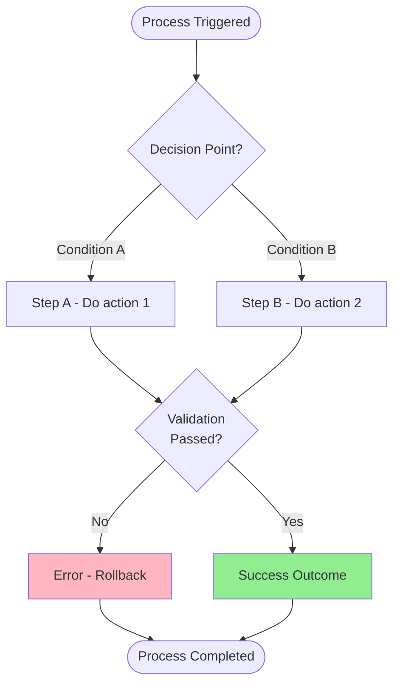
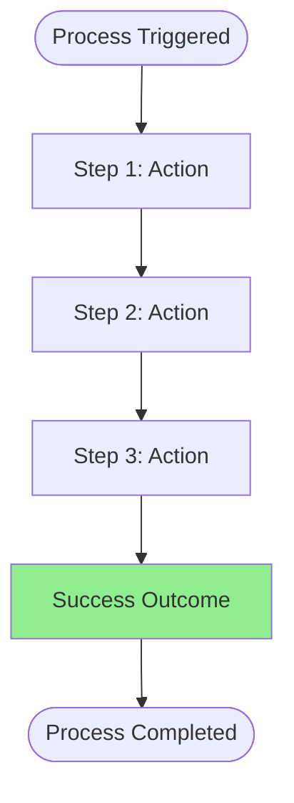

# Business Requirements Document

**⚠️ Complexity Levels:**
- 🟢 **Core** = Required for ALL projects (Simple MVP, Standard, Enterprise)
- 🟡 **Standard** = Required for Standard & Enterprise projects
- 🔴 **Enterprise** = Required for Enterprise projects only

---

## Document Control

| Field | Value |
|-------|-------|
| Project Name | [PROJECT NAME] |
| Document Version | [VERSION] |
| Status | draft / review / approved / implemented |
| Author | [AUTHOR NAME] |
| Date Created | [DATE] |
| Last Updated | [DATE] |
| Approved By | [APPROVER NAME] |
| Approval Date | [APPROVAL DATE] |

---

## 1. Executive Summary 🟢 **CORE**

### 1.1 Project Overview
**Project Name:** [Project Name]

**Purpose:** [Brief description of the project purpose and goals]

**Target Users:**
- [User Group 1] ([number] users)
- [User Group 2] ([number] users)
- [User Group 3] ([number] users)

### 1.2 Business Objectives
1. [Business Objective 1]
2. [Business Objective 2]
3. [Business Objective 3]

### 1.3 Success Metrics
- [Metric 1]: [Target value]
- [Metric 2]: [Target value]
- [Metric 3]: [Target value]
- [Metric 4]: [Target value]

---

## 2. Stakeholders 🟢 **CORE**

| Role | Name | Responsibility | Contact |
|------|------|---------------|---------|
| Product Owner | [Name] | [Responsibility] | [Email] |
| Business Sponsor | [Name] | [Responsibility] | [Email] |
| Technical Lead | [Name] | [Responsibility] | [Email] |
| End Users | [Group Name] | [Responsibility] | [Contact] |

---

## 3. Business Context 🟢 **CORE**

### 3.1 Background
[Describe the business context, current situation, and why this project is needed]

### 3.2 Problem Statement
[Describe the problems or challenges that need to be solved]

### 3.3 Proposed Solution
[High-level description of the proposed solution]

### 3.4 Business Value
[Explain the expected business value and benefits]

---

## 4. Scope 🟢 **CORE**

### 4.1 In Scope
Features and capabilities that WILL be included:
- [Feature 1]
- [Feature 2]
- [Feature 3]

### 4.2 Out of Scope
Features and capabilities that will NOT be included:
- [Feature 1]
- [Feature 2]
- [Feature 3]

### 4.3 Future Scope
Features planned for future releases:
- [Feature 1] (Target: [Release/Date])
- [Feature 2] (Target: [Release/Date])

---

## 5. Business Processes 🟡 **STANDARD**

### 5.1 [Process Name 1]

**Actor:** [Primary user role]

**Trigger:** [What initiates this process]

**Precondition:** [What must be true before this process starts]

**Flow:**
1. [Step 1]
2. [Step 2]
3. [Step 3 - Decision Point]
4. [Step 4]

**Success Outcome:** [What success looks like]

**Alternative Flows:**
- **Alt 1:** [Condition] → [Alternative steps]
- **Alt 2:** [Condition] → [Alternative steps]

**Error Handling:**
- **Error 1:** [Error condition] → [Resolution]
- **Error 2:** [Error condition] → [Resolution]

**Flow Diagram:**

---

### 5.2 [Process Name 2]

**Actor:** [Primary user role]

**Trigger:** [What initiates this process]

**Precondition:** [What must be true before this process starts]

**Flow:**
1. [Step 1]
2. [Step 2]
3. [Step 3]

**Success Outcome:** [What success looks like]

**Flow Diagram:**

---

## 6. Functional Requirements

### 6.1 [Module Name 1]

#### FR-[MOD]-001: [Requirement Title]
**Priority:** P0 (Must Have) | P1 (Should Have) | P2 (Nice to Have)

**Description:** [Detailed description of the requirement]

**Inputs:**
- [Input 1] (required/optional, data type, constraints)
- [Input 2] (required/optional, data type, constraints)
- [Input 3] (required/optional, data type, constraints)

**Outputs:**
- [Output 1] (description)
- [Output 2] (description)

**Business Rules:**
- [Rule 1]
- [Rule 2]
- [Rule 3]

**Validation:**
- [Validation 1]
- [Validation 2]
- [Validation 3]

**Integration:**
- [System 1]: [Integration description]
- [System 2]: [Integration description]

**Acceptance Criteria:**
- [ ] [Criterion 1]
- [ ] [Criterion 2]
- [ ] [Criterion 3]

---

#### FR-[MOD]-002: [Requirement Title]
[Follow same structure as above]

---

### 6.2 [Module Name 2]

#### FR-[MOD2]-001: [Requirement Title]
[Follow same structure as above]

---

## 7. Non-Functional Requirements 🟡 **STANDARD**

### 7.1 Performance
- **Response Time:** [API response time target] (e.g., < 500ms for 95th percentile)
- **Page Load Time:** [UI load time target] (e.g., < 2 seconds)
- **Throughput:** [Requests per second] (e.g., support 100 concurrent users)
- **Database Query Time:** [Query time target] (e.g., < 100ms)

### 7.2 Scalability
- **User Capacity:** [Number of concurrent users]
- **Data Volume:** [Expected data volume] (e.g., 1M records)
- **Growth Rate:** [Expected growth] (e.g., 20% per year)

### 7.3 Availability & Reliability
- **Uptime:** [Target uptime percentage] (e.g., 99.5%)
- **Backup Frequency:** [Backup schedule] (e.g., daily automated backup)
- **Recovery Time Objective (RTO):** [Maximum downtime] (e.g., 4 hours)
- **Recovery Point Objective (RPO):** [Maximum data loss] (e.g., 24 hours)

### 7.4 Security
- **Authentication:** [Authentication method] (e.g., JWT with 15-minute expiry)
- **Authorization:** [Authorization model] (e.g., RBAC - Role-Based Access Control)
- **Encryption:** 
  - Data at rest: [Encryption standard] (e.g., AES-256)
  - Data in transit: [Encryption protocol] (e.g., TLS 1.3)
- **Audit Logging:** [Audit requirements] (e.g., all data changes logged)
- **Compliance:** [Compliance standards] (e.g., HIPAA, ISO 27001, GDPR)

### 7.5 Usability
- **User Interface:** [UI requirements] (e.g., responsive design, mobile-friendly)
- **Browser Support:** [Supported browsers] (e.g., Chrome, Firefox, Safari - latest 2 versions)
- **Accessibility:** [Accessibility standards] (e.g., WCAG 2.1 Level AA)
- **Language Support:** [Languages] (e.g., English, Indonesian)

### 7.6 Maintainability
- **Code Standards:** [Coding standards to follow]
- **Documentation:** [Documentation requirements]
- **Testing Coverage:** [Test coverage target] (e.g., > 80% unit test coverage)
- **Monitoring:** [Monitoring requirements] (e.g., APM, error tracking, logging)

---

## 8. Data Requirements 🟡 **STANDARD**

### 8.1 Master Data
- [Master Data 1] ([volume estimate])
- [Master Data 2] ([volume estimate])
- [Master Data 3] ([volume estimate])

### 8.2 Transaction Data
- [Transaction Type 1] (estimated volume: [number/day])
- [Transaction Type 2] (estimated volume: [number/day])
- [Transaction Type 3] (estimated volume: [number/day])

### 8.3 Data Retention
- [Data Type 1]: [Retention period] (e.g., Indefinite)
- [Data Type 2]: [Retention period] (e.g., 7 years after deletion)
- [Data Type 3]: [Retention period] (e.g., 90 days)

### 8.4 Data Migration
- [Source System 1]: [Migration description]
- [Source System 2]: [Migration description]

### 8.5 Data Privacy
- **PII (Personally Identifiable Information):**
  - [PII field 1]: [Protection requirements]
  - [PII field 2]: [Protection requirements]
- **PHI (Protected Health Information):** [If applicable]
  - [PHI field 1]: [Protection requirements]

---

## 9. Integration Requirements 🟡 **STANDARD**

### 9.1 [External System 1]

**System Name:** [System name]

**Purpose:** [Integration purpose]

**Protocol:** [Integration protocol] (e.g., REST API, SOAP, GraphQL)

**Authentication:** [Auth method] (e.g., OAuth 2.0, API Key)

**Sync Frequency:** [Sync schedule] (e.g., Real-time, Hourly, Daily)

**Data Exchanged:**
- **Outbound:** [Data sent to system]
- **Inbound:** [Data received from system]

**SLA:** [Service level agreement]

**Error Handling:** [Error handling approach]

---

### 9.2 [External System 2]

[Follow same structure as above]

---

## 10. Role-Based Access Control (RBAC) 🔴 **ENTERPRISE**

### 10.1 User Roles & Permissions

Define all user roles and their permissions matrix.

| Role | [Module 1] | [Module 2] | [Module 3] | [Module 4] | [Module 5] | [Reports] |
|------|-----------|-----------|-----------|-----------|-----------|-----------|
| **[Role 1]** | ✅ | ❌ | 👀 (View) | ❌ | ✅ | 👀 |
| **[Role 2]** | ✅ | ✅ | ✅ | ❌ | 👀 | ✅ |
| **[Role 3]** | ❌ | ✅ | ✅ | ✅ | ✅ | ✅ |
| **[Role 4]** | ✅ | ✅ | ✅ | ✅ | ✅ | ✅ |
| **Admin** | ✅ | ✅ | ✅ | ✅ | ✅ | ✅ |

**Legend:**
- ✅ = Full Access (Create, Read, Update, Delete)
- 👀 = View Only (Read)
- ❌ = No Access

### 10.2 Role Descriptions

#### [Role 1 Name]
**Responsibilities:**
- [Responsibility 1]
- [Responsibility 2]
- [Responsibility 3]

**Permissions:**
- [Module 1]: Create & Edit [Resource]
- [Module 2]: View [Resource]
- Reports: View [Report]

**Constraints:**
- [Constraint 1] (e.g., Can only access own department)
- [Constraint 2]

#### [Role 2 Name]
[Follow same structure as above]

---

## 11. Technology Stack & Architecture 🔴 **ENTERPRISE**

### 11.1 Frontend

**Type:** [SPA / MPA / PWA]

**Framework/Libraries:**
- **Primary Framework:** [e.g., React, Vue, Angular]
- **Version:** [Version]
- **Build Tool:** [e.g., Vite, Webpack, Next.js]
- **Package Manager:** [npm / yarn / pnpm]

**UI Framework:**
- **Design System:** [e.g., Material Design, Tailwind CSS, Custom]
- **UI Library:** [e.g., Material-UI, Bootstrap, Shadcn UI]
- **Styling:** [e.g., CSS-in-JS, Tailwind, SCSS]

**Key Libraries:**
- State Management: [Redux / Zustand / Context API]
- HTTP Client: [Axios / Fetch / SWR]
- Form Validation: [React Hook Form / Formik]
- Date/Time: [Moment.js / date-fns / Day.js]

**Browser Support:**
- [Chrome, Firefox, Safari, Edge] - Latest 2 versions
- [Mobile browsers: iOS Safari, Chrome Android]

**Performance Requirements:**
- Page Load Time: [< X seconds]
- First Contentful Paint (FCP): [< X seconds]
- Time to Interactive (TTI): [< X seconds]

### 11.2 Backend

**Language:** [e.g., Go, Python, Node.js, Java]

**Framework:** [e.g., Lokstra, Django, Express, Spring Boot]

**Version:** [Version]

**Architecture Pattern:**
- [Monolithic / Microservices / Modular Monolith]
- [Layered / Hexagonal / DDD / Clean Architecture]

**Key Components:**
- **API:** [REST / GraphQL / gRPC]
- **Authentication:** [JWT / OAuth 2.0 / Session-based]
- **Authorization:** [RBAC / ABAC / Custom]
- **Logging:** [Structured logging / ELK Stack / CloudWatch]
- **Monitoring:** [Prometheus / New Relic / DataDog]
- **Error Tracking:** [Sentry / Rollbar / New Relic]

**External Integrations:**
- [Integration 1]: [API / Protocol / Library]
- [Integration 2]: [API / Protocol / Library]

### 11.3 Database

**Primary Database:** [PostgreSQL / MySQL / MongoDB / Oracle]

**Version:** [Version]

**Schema Design:**
- **Approach:** [Relational / Document / Hybrid]
- **Normalization:** [3NF / Denormalized / Event Sourcing]
- **Key Features:** [JSONB / Full-text Search / Array Types / Geo Types]

**Backup & Recovery:**
- **Backup Frequency:** [Daily / Hourly / Continuous]
- **Backup Location:** [Local / Cloud / Multi-region]
- **RTO (Recovery Time Objective):** [X hours]
- **RPO (Recovery Point Objective):** [X hours]

**Performance Tuning:**
- **Indexes:** [B-tree / Hash / GIN / GIST]
- **Partitioning:** [Time-based / Range-based / Hash-based]
- **Replication:** [Master-Slave / Master-Master / Read Replicas]

### 11.4 Infrastructure & Deployment

**Hosting:** [Cloud / On-Premise / Hybrid]

**Cloud Provider (if applicable):** [AWS / GCP / Azure / DigitalOcean]

**Containerization:**
- **Docker:** [Yes / No]
- **Orchestration:** [Kubernetes / Docker Compose / ECS]

**CI/CD Pipeline:**
- **Version Control:** [Git / GitLab / Bitbucket]
- **CI/CD Tool:** [GitHub Actions / GitLab CI / Jenkins / CircleCI]
- **Deployment Strategy:** [Blue-Green / Canary / Rolling / Feature Flags]

**Environments:**
- Development
- Staging
- Production

**Scalability:**
- **Horizontal Scaling:** [Load Balancer / Auto-scaling]
- **Vertical Scaling:** [Max CPU/Memory resources]
- **CDN:** [CloudFlare / AWS CloudFront / Akamai]

### 11.5 Security

**Data Protection:**
- **Encryption at Rest:** [AES-256 / TDE / KMS]
- **Encryption in Transit:** [TLS 1.3 / mTLS]
- **Key Management:** [AWS KMS / HashiCorp Vault / Custom]

**Access Control:**
- **Network:** [Firewall / Security Groups / NACLs]
- **Application:** [RBAC / ABAC / OAuth 2.0]
- **Database:** [Row-level Security / Column-level Security]

**Compliance:**
- [HIPAA / GDPR / ISO 27001 / SOC 2 / Custom]

**Audit & Monitoring:**
- **Audit Logging:** [All data changes logged]
- **Security Monitoring:** [SIEM / WAF / DDoS Protection]

### 11.6 Third-Party Services

| Service | Purpose | Provider | Cost |
|---------|---------|----------|------|
| [Service 1] | [Purpose] | [Provider] | [Cost Model] |
| [Service 2] | [Purpose] | [Provider] | [Cost Model] |
| [Service 3] | [Purpose] | [Provider] | [Cost Model] |

---

## 12. User Interface Requirements 🟡 **STANDARD**

### 12.1 Web Application
- **Type:** [SPA / MPA / Progressive Web App]
- **Framework:** [Preferred framework] (e.g., React, Vue, Angular)
- **Responsive:** [Requirements] (e.g., Desktop + Tablet + Mobile)
- **Browser Support:** [Browsers and versions]

### 12.2 Mobile Application (if applicable)
- **Platform:** [iOS / Android / Both]
- **Native / Hybrid:** [Native / React Native / Flutter]
- **Minimum OS Version:** [Version]

### 12.3 Design System
- **Design Tool:** [Figma / Sketch / Adobe XD]
- **UI Kit:** [Custom / Material Design / Bootstrap]
- **Branding:** [Brand guidelines to follow]

---

## 13. Reporting & Analytics 🟡 **STANDARD**

### 13.1 Required Reports
- **Report 1:** [Report name]
  - Purpose: [Report purpose]
  - Frequency: [Daily / Weekly / Monthly / On-demand]
  - Data: [Data included]
  - Format: [PDF / Excel / CSV / Dashboard]

- **Report 2:** [Report name]
  - [Same structure]

### 13.2 Analytics Requirements
- [Analytics requirement 1]
- [Analytics requirement 2]
- [Analytics requirement 3]

---

## 14. Training & Support 🟡 **STANDARD**

### 14.1 Training Requirements
- **Admin Users:** [Training description]
- **End Users:** [Training description]
- **Technical Team:** [Training description]

### 14.2 Documentation
- **User Manual:** [Requirements]
- **Admin Manual:** [Requirements]
- **Technical Documentation:** [Requirements]
- **API Documentation:** [Requirements]

### 14.3 Support Model
- **Support Hours:** [Hours of operation]
- **Support Channels:** [Email / Phone / Chat / Ticketing]
- **Response Time:** [SLA for support]

---

## 15. Assumptions & Constraints 🟢 **CORE**

### 15.1 Assumptions
- [Assumption 1]
- [Assumption 2]
- [Assumption 3]

### 15.2 Constraints
- **Budget:** [Budget constraint]
- **Timeline:** [Timeline constraint]
- **Resources:** [Resource constraint]
- **Technology:** [Technology constraint]
- **Regulatory:** [Regulatory constraint]

### 15.3 Dependencies
- [Dependency 1]
- [Dependency 2]
- [Dependency 3]

---

## 16. Risks & Mitigation 🟢 **CORE**

| Risk ID | Risk Description | Impact | Probability | Mitigation Strategy |
|---------|-----------------|--------|-------------|---------------------|
| R-001 | [Risk 1] | High / Medium / Low | High / Medium / Low | [Mitigation] |
| R-002 | [Risk 2] | High / Medium / Low | High / Medium / Low | [Mitigation] |
| R-003 | [Risk 3] | High / Medium / Low | High / Medium / Low | [Mitigation] |

---

## 17. Timeline & Milestones 🟢 **CORE**

| Milestone | Target Date | Deliverables |
|-----------|------------|--------------|
| Phase 1: [Name] | [Date] | [Deliverables] |
| Phase 2: [Name] | [Date] | [Deliverables] |
| Phase 3: [Name] | [Date] | [Deliverables] |
| Go-Live | [Date] | [Deliverables] |

---

## 18. Budget Estimate 🟡 **STANDARD**

| Category | Estimated Cost |
|----------|---------------|
| Development | $[amount] |
| Infrastructure | $[amount] |
| Licenses | $[amount] |
| Training | $[amount] |
| Support & Maintenance (Year 1) | $[amount] |
| **Total** | **$[total]** |

---

## 19. Glossary 🟡 **STANDARD**

| Term | Definition |
|------|------------|
| [Term 1] | [Definition] |
| [Term 2] | [Definition] |
| [Term 3] | [Definition] |

---

## 20. References 🟡 **STANDARD**

- [Reference 1]
- [Reference 2]
- [Reference 3]

---

## 21. Approval 🟢 **CORE**

| Role | Name | Signature | Date |
|------|------|-----------|------|
| Product Owner | [Name] |  | [Date] |
| Business Sponsor | [Name] |  | [Date] |
| Technical Lead | [Name] |  | [Date] |
| Legal (if required) | [Name] |  | [Date] |

---

## 22. Document History 🟡 **STANDARD**

| Version | Date | Author | Changes |
|---------|------|--------|---------|
| [VERSION] | [DATE] | [AUTHOR] | [CHANGES] |

---

## Appendices

### Appendix A: Detailed Use Cases
[Detailed use case diagrams or descriptions]

### Appendix B: Data Dictionary
[Detailed data dictionary if needed]

### Appendix C: Wireframes / Mockups
[Link to UI designs or include screenshots]

### Appendix D: Technical Architecture
[High-level technical architecture diagram]

---

**End of Document**
