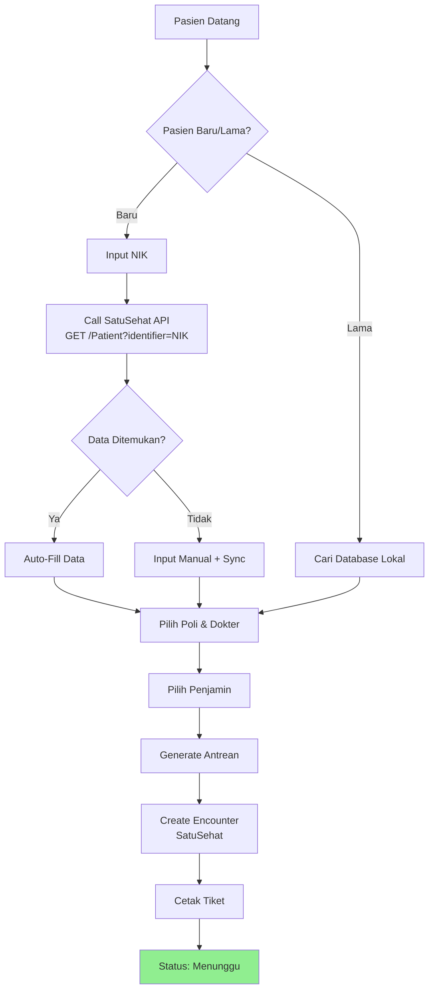

# BUSINESS REQUIREMENTS DOCUMENT - EXAMPLE

## SISTEM INFORMASI KLINIK TERINTEGRASI SATUSEHAT (MVP)

**Versi:** 1.0  
**Status:** Draft  
**Tanggal:** 2026-01-29  
**Author:** Tim Klinik

---

## 1. INFORMASI UMUM

### 1.1 Tujuan Proyek

Membangun Minimum Viable Product (MVP) Sistem Informasi Manajemen Klinik yang mengelola alur pasien dari pendaftaran hingga pelaporan, dengan fokus utama pada:
- Efisiensi operasional (reduce manual paperwork)
- Kepatuhan terhadap standar SatuSehat Kemenkes RI
- Integrasi dengan ekosistem digital kesehatan nasional

### 1.2 Target Pengguna

| User Group | Jumlah | Deskripsi |
|------------|--------|-----------|
| **Front Office** | 2-3 | Pendaftaran pasien, verifikasi asuransi, generate antrean |
| **Kasir** | 1-2 | Billing & pembayaran, penjualan obat langsung |
| **Dokter** | 2-5 | Anamnesa, pemeriksaan, diagnosa, resep |
| **Perawat/Nakes** | 2-3 | Vital sign, triage, tindakan keperawatan |
| **Unit Penunjang** | 1-2 | Lab/Radiologi - input hasil pemeriksaan |
| **Farmasi/Apoteker** | 1-2 | Verifikasi resep, dispensing obat, manage stok |
| **Administrator** | 1 | Manajemen user, master data |

### 1.3 Tujuan Bisnis

1. Mengurangi waktu pelayanan pasien (dari 45 menit menjadi 30 menit)
2. Akurasi data pasien 100% (SatuSehat compliance)
3. Mencegah kesalahan pemberian obat (E-Resep verification)
4. Meningkatkan pencatatan medis (SOAP completion rate > 95%)
5. Laporan real-time untuk manajemen

### 1.4 Metrik Kesuksesan

| Metrik | Target | Timeline |
|--------|--------|----------|
| System Uptime | 99.5% | Ongoing |
| API Response Time | < 500ms (95th percentile) | Production |
| RME Completion Rate | > 95% | 3 bulan |
| E-Resep Adoption | 100% untuk Poli | 2 bulan |
| Data Accuracy (SatuSehat) | 100% | 1 bulan |

---

## 2. CAKUPAN SISTEM (SCOPE - MVP)

### 2.1 In Scope

| Feature | Priority | Estimasi |
|---------|----------|----------|
| SatuSehat Bridging (Patient & Encounter) | P0 | Sprint 2 |
| Rawat Jalan - Poli Umum/Spesialis | P0 | Sprint 3 |
| Rekam Medis Elektronik (RME) - SOAP | P0 | Sprint 3 |
| E-Prescribing & Dispensing | P0 | Sprint 4 |
| Farmasi Inventory (Multi-lokasi, Batch) | P0 | Sprint 4 |
| Billing & Kasir (Simple Invoice) | P0 | Sprint 5 |
| Unit Penunjang - Lab/Radiologi | P0 | Sprint 5 |
| Dashboard Antrean | P1 | Sprint 2 |
| User Management & RBAC | P0 | Sprint 1 |

### 2.2 Out of Scope

- Accounting GL integration
- HR/Payroll management
- Purchasing & Supplier management
- Insurance claim processing
- Mobile app (web-only MVP)
- Telemedicine features

### 2.3 Future (Phase 2+)

- AR (Account Receivable) - Insurance claims
- AP (Account Payable) - Supplier management
- Purchasing system
- Mobile app (iOS/Android)
- Advanced reporting & BI
- Telemedicine integration

---

## 3. ALUR KERJA SISTEM (BUSINESS PROCESSES)

### 3.1 Proses Registrasi Pasien (Integrasi SatuSehat)

**Actor:** Front Office  
**Trigger:** Pasien datang ke klinik  
**Precondition:** SatuSehat API accessible, offline mode enabled

**Flow:**

1. FO tanya: "Pasien baru atau lama?"
2. Jika **Baru:**
   - Input NIK pasien
   - System: Call `GET /Patient?identifier=NIK` (SatuSehat API)
   - Jika data ditemukan: Auto-fill nama, tanggal lahir, alamat
   - Jika tidak ditemukan: Input manual, sync ke SatuSehat as new patient
3. Jika **Lama:**
   - Cari di database lokal (Nama/RM/NIK)
4. Pilih Poli & Dokter (untuk rawat jalan)
5. Pilih Tipe Penjamin (Umum/Asuransi/BPJS)
6. Cetak Tiket Antrean
7. System: Create `Encounter` (SatuSehat) dengan status "in-progress"

**Success Outcome:** Patient registered, encounter created, queue ticket printed

**Alternative Flows:**
- **Alt 1 - Offline Mode:** Network unavailable → Use local database only, sync when online
- **Alt 2 - Walk-in Lab:** Pasien langsung ke lab tanpa poli → Skip poli selection, go to Lab order

**Error Handling:**
- **SatuSehat API timeout:** Fallback ke manual registration, queue for sync
- **Duplicate NIK:** Show warning, verify before proceeding

**Flow Diagram:**



### 3.2 Proses Pelayanan Medis & Pembayaran

**Actor:** Dokter, Perawat, Kasir  
**Trigger:** Pasien dipanggil ke poli

**Flow:**

1. **Perawat (Triage):**
   - Input Vital Sign (Tensi, Nadi, Suhu, RR, BB, TB)
   - Auto-map ke `Observation` (LOINC code)
   - System: Sync ke SatuSehat

2. **Dokter (SOAP):**
   - **S (Subjective):** Keluhan utama, Riwayat Penyakit Sekarang (RPS)
   - **O (Objective):** Hasil pemeriksaan fisik
   - **A (Assessment):** Input diagnosa (search ICD-10), auto-map ke `Condition` SatuSehat
   - **P (Plan):**
     - **Tindakan:** Search ICD-9-CM, auto-map ke `Procedure`
     - **Resep:** Search KFA, input dosis & instruksi, auto-map ke `MedicationRequest`
   - **Finalisasi RME:** Mark encounter as complete

3. **Kasir (Billing):**
   - Auto-generate invoice: Jasa Medis + Tindakan + Obat + Admin fee
   - Tipe pembayaran: Cash / QRIS / Card
   - Mark encounter complete in SatuSehat

**Success Outcome:** RME complete, encounter closed, payment received, data synced to SatuSehat

**Prepaid vs Postpaid:**
- **Prepaid:** Tindakan/Lab tertentu → bayar dulu → unlock hasil input
- **Postpaid:** Tindakan insidental → bayar setelah selesai

---

### 3.3 Proses Penjualan Farmasi (Resep + OTC)

**Actor:** Kasir, Apoteker  
**Trigger:** Pasien ke farmasi with resep or OTC request

**Flow:**

1. **Kasir:**
   - Registrasi pasien (jika belum)
   - Input resep: Scan/manual input dari dokter klinik atau resep luar
   
2. **Apoteker (Verifikasi):**
   - Check ketersediaan stok (FIFO by batch)
   - Cek interaksi obat (if available)
   - Verifikasi resep vs pasien
   - Mark "Approved"

3. **Kasir (Billing):**
   - Calculate total price
   - Process payment

4. **Apoteker (Dispensing):**
   - Confirm stock allocated
   - Reduce stock (automated)
   - Print label (Nama Pasien, Aturan Pakai)
   - Handover ke pasien
   - System: Create `MedicationDispense` event → Send to SatuSehat

**Success Outcome:** Obat diserahkan, stok updated, data logged

**Tipe Penjualan:**
- **E-Resep (dari Poli):** Auto-sync dari dokter → Apoteker terima di sistem
- **Manual Resep (dari Luar):** Kasir input manual, Apoteker verifikasi
- **OTC (Obat Bebas):** Kasir input, Apoteker dispense, no resep needed

---

## 4. KEBUTUHAN FUNGSIONAL DETAIL

### 4.1 Modul Pendaftaran & Antrean (Front Office)

| Feature | Deskripsi | Technical Detail |
|---------|-----------|-----------------|
| **KYC Pasien** | Input NIK → SatuSehat lookup | Call `/Patient?identifier=NIK` |
| **Registrasi Kunjungan** | Pilih Poli, Dokter, Penjamin | Create Encounter, set status |
| **Dashboard Antrean** | TV display queue per poli | Real-time WebSocket update |
| **Auto Sync Offline** | Queue sync when online | Background job, retry logic |

### 4.2 Modul Rekam Medis (Dokter & Perawat)

| Feature | Deskripsi | Technical Detail |
|---------|-----------|-----------------|
| **Vital Sign Input** | Perawat input TTV | Map to LOINC codes |
| **SOAP Entry** | Dokter input diagnosis & plan | ICD-10/ICD-9-CM search |
| **E-Prescription** | Generate electronic resep | KFA database, auto-map to FHIR |
| **Riwayat Medis** | View past encounters | Timeline view with filters |

### 4.3 Modul Farmasi

| Feature | Deskripsi | Technical Detail |
|---------|-----------|-----------------|
| **Inventory Multi-Lokasi** | Manage stok di Gudang/Poli | Batch tracking, expiry date |
| **E-Resep Queue** | Notifikasi resep masuk | Real-time notification |
| **Verifikasi Resep** | Apoteker review & approve | Check stok, interaksi obat |
| **Dispensing** | Confirm, print label, reduce stok | Transaction log, SatuSehat sync |

### 4.4 Modul Kasir & Billing

| Feature | Deskripsi | Technical Detail |
|---------|-----------|-----------------|
| **Invoice Auto-Generate** | Jasa + Tindakan + Obat + Admin | Sum all charges |
| **Penjualan OTC** | Obat bebas tanpa resep | Direct sales, no RME needed |
| **Payment Processing** | Cash/QRIS/Card | Payment gateway integration |
| **Closing Kasir** | Daily report per shift | Export to Excel/PDF |

---

## 5. INTEGRASI SATUSEHAT

### 5.1 Resource Mapping

| SatuSehat Resource | Local Table | Sync Trigger | Mandatory Fields |
|-------------------|-------------|--------------|-----------------|
| **Patient** | patients | Registrasi baru | NIK, Nama, DOB, Gender |
| **Encounter** | encounters | Check-in & Finish | PatientID, PractitionerID, Timestamp |
| **Observation** | vital_signs | Input Vital | Code (LOINC), Value, Unit |
| **Condition** | diagnoses | Input Diagnosa | Code (ICD-10), EncounterId |
| **Procedure** | procedures | Input Tindakan | Code (ICD-9-CM), EncounterId |
| **MedicationRequest** | prescriptions | Finalize Resep | Code (KFA), Dosage, Route |
| **MedicationDispense** | dispensed_medications | Serah Obat | MedReqId, Qty, Timestamp |

### 5.2 API Configuration

```
- Base URL: https://api-satusehat.kemkes.go.id/fhir-r4/v1/
- Authentication: OAuth 2.0 (Client Credentials)
- Sync Mode: Push (setiap transaksi)
- Offline Mode: Queue & retry when online
- Organization ID: [Dari SatuSehat Onboarding]
- Location ID: [Dari SatuSehat Onboarding]
- Practitioner IDs: [Dari SatuSehat]
```

---

## 6. PERAN & HAK AKSES (RBAC)

| Role | Pendaftaran | RME | Resep Input | Resep Proses | Billing | OTC | Laporan |
|------|:-----------:|:---:|:-----------:|:------------:|:-------:|:---:|:-------:|
| **Front Office** | ✅ | ❌ | ❌ | ❌ | 👀 | ❌ | ✅ |
| **Dokter** | 👀 | ✅ | ✅ | ❌ | 👀 | ❌ | ✅ |
| **Perawat** | 👀 | ✅ (S,O) | ❌ | ❌ | ❌ | ❌ | ❌ |
| **Kasir** | ✅ | ❌ | ❌ | ❌ | ✅ | ✅ | ✅ |
| **Apoteker** | ❌ | 👀 | ✅ | ✅ | 👀 | ✅ | ✅ |
| **Lab/Rad** | ❌ | ❌ | ❌ | ❌ | ❌ | ❌ | ❌ |
| **Admin** | ✅ | ✅ | ✅ | ✅ | ✅ | ✅ | ✅ |

**Legend:** ✅ = Full Access | 👀 = View Only | ❌ = No Access

---

## 7. TECHNOLOGY STACK

### 7.1 Frontend

```
Type: Single Page Application (SPA)
Framework: React 18+ (Next.js)
UI Library: Shadcn UI + Tailwind CSS
HTTP Client: Axios
State Management: Zustand
Form: React Hook Form
Testing: Vitest + React Testing Library
```

### 7.2 Backend

```
Language: Go 1.21+
Framework: Lokstra (Custom DI Framework)
API: REST (FHIR R4 compliance)
Authentication: JWT (15-min expiry)
Database: PostgreSQL 14+
```

### 7.3 Database

```
Type: PostgreSQL 14+ (Relational)
Schema: Multi-tenant support
Key Features: JSONB for FHIR resources
Backup: Daily automated, 7-day retention
Replication: Master-Slave (Hot Standby)
```

### 7.4 Infrastructure

```
Hosting: AWS EC2 (On-Premise Option Available)
Containerization: Docker + Docker Compose
CI/CD: GitHub Actions
Environment: Dev → Staging → Prod
Monitoring: Prometheus + Grafana
Logging: ELK Stack (Elasticsearch, Logstash, Kibana)
```

### 7.5 Security

```
Encryption at Rest: AES-256 (RDS encryption)
Encryption in Transit: TLS 1.3
API Authentication: OAuth 2.0 (SatuSehat) + JWT (Internal)
RBAC: Role-based access control
Audit Log: All data changes logged
Compliance: HIPAA-ready, ISO 27001 in progress
```

---

## 8. TIMELINE & MILESTONES

| Sprint | Duration | Deliverables | Status |
|--------|----------|--------------|--------|
| **Sprint 1** | Wk 1-2 | Setup, DB Schema, Master Data | In Progress |
| **Sprint 2** | Wk 3-4 | Pendaftaran + SatuSehat Integrasi | Upcoming |
| **Sprint 3** | Wk 5-7 | RME (SOAP) + Unit Penunjang | Upcoming |
| **Sprint 4** | Wk 8-9 | Farmasi Lengkap + E-Resep | Upcoming |
| **Sprint 5** | Wk 10-11 | Kasir & Billing | Upcoming |
| **Sprint 6** | Wk 12-13 | UAT & Deployment | Upcoming |

**Go-Live Target:** Maret 2026

---

## 9. RISIKO & MITIGASI

| Risk | Impact | Probability | Mitigation |
|------|--------|-------------|-----------|
| SatuSehat API instability | High | Medium | Build robust retry logic, offline mode |
| Data accuracy (SatuSehat sync) | High | Low | Unit tests, integration tests, manual verification |
| User adoption (workflow change) | Medium | High | Extensive training, phased rollout per department |
| Performance under load | Medium | Medium | Load testing, database optimization |
| Security/Compliance (HIPAA) | High | Low | Security audit, encryption, audit logs |

---

## 10. ANGGARAN & ESTIMASI

| Item | Cost | Notes |
|------|------|-------|
| Development (8 sprints × 2 devs) | $40,000 | Includes backend & frontend |
| Infrastructure (AWS, monthly) | $2,000 | Dev + Staging + Prod |
| SatuSehat Integration (Consulting) | $5,000 | API integration, FHIR compliance |
| Training & Documentation | $3,000 | User training, admin docs |
| **Total MVP** | **$50,000** | Approximate |

---

## 11. STAKEHOLDER APPROVAL

| Role | Nama | Signature | Date |
|------|------|-----------|------|
| Pemilik Klinik | [Name] | _______ | [Date] |
| Kepala Medis | Dr. [Name] | _______ | [Date] |
| Kepala IT | [Name] | _______ | [Date] |
| Project Manager | [Name] | _______ | [Date] |

---

**End of Example BRD**

*This is a real-world example of a Clinic Management System BRD. Use this as reference when filling out BRD_TEMPLATE.md for your own project.*
