# Mermaid Diagram Templates for BRD

Reusable diagram templates to clarify BRD documents. Copy and customize for your project.

---

## 1. System Context Diagram (C4 Level 1)

Use to show system and external actors/integrations.

```mermaid
flowchart TB
    subgraph Users["👥 Users"]
        FO[Front Office]
        DOC[Doctor]
        NURSE[Nurse]
        PHARM[Pharmacist]
        ADMIN[Admin]
    end

    subgraph System["🏥 [System Name]"]
        APP[Main Application]
    end

    subgraph External["🔗 External Systems"]
        SATUSEHAT[SatuSehat API]
        PAYMENT[Payment Gateway]
        EMAIL[Email Service]
    end

    FO --> APP
    DOC --> APP
    NURSE --> APP
    PHARM --> APP
    ADMIN --> APP

    APP <--> SATUSEHAT
    APP <--> PAYMENT
    APP --> EMAIL
```



**How to Use:**
1. Replace `[System Name]` with your system name
2. Adjust Users with user roles from BRD
3. Adjust External Systems with integrations

---

## 2. High-Level User Flow

Use to show the main user journey through the system.

```mermaid
flowchart LR
    subgraph Registration["📋 Registration"]
        A1[Patient Arrives] --> A2[Search/Register Patient]
        A2 --> A3[Create Queue Number]
    end

    subgraph Consultation["🩺 Consultation"]
        B1[Call Patient] --> B2[Examination & SOAP]
        B2 --> B3[Create Prescription]
    end

    subgraph Pharmacy["💊 Pharmacy"]
        C1[Receive Prescription] --> C2[Verify & Dispensing]
        C2 --> C3[Ready for Pickup]
    end

    subgraph Payment["💰 Payment"]
        D1[Generate Invoice] --> D2[Receive Payment]
        D2 --> D3[Complete]
    end

    Registration --> Consultation --> Pharmacy --> Payment
```



**How to Use:**
1. Adjust stages with your business process
2. Add/remove steps according to scope

---

## 3. User Role & Permission Matrix

Use to visualize RBAC (Role-Based Access Control).

```mermaid
flowchart TB
    subgraph Roles["🔐 User Roles"]
        ADMIN[Admin<br/>Full Access]
        MANAGER[Manager<br/>Reports + Settings]
        STAFF[Staff<br/>Operations]
        VIEWER[Viewer<br/>Read Only]
    end

    subgraph Modules["📦 Modules"]
        M1[User Management]
        M2[Patient Records]
        M3[Prescriptions]
        M4[Billing]
        M5[Reports]
    end

    ADMIN --> M1
    ADMIN --> M2
    ADMIN --> M3
    ADMIN --> M4
    ADMIN --> M5

    MANAGER --> M2
    MANAGER --> M4
    MANAGER --> M5

    STAFF --> M2
    STAFF --> M3
    STAFF --> M4

    VIEWER --> M5

    style ADMIN fill:#e74c3c,color:#fff
    style MANAGER fill:#f39c12,color:#fff
    style STAFF fill:#3498db,color:#fff
    style VIEWER fill:#95a5a6,color:#fff
```



---

## 4. State Diagram (Entity Lifecycle)

Use to show status transitions (e.g., Order, Appointment).


**Common Use Cases:**
- Order status (Draft → Pending → Processing → Shipped → Delivered)
- Appointment status (Scheduled → Confirmed → In Progress → Completed)
- Document status (Draft → Review → Approved → Published)

---

## 5. Entity Relationship Diagram (ERD Simplified)

Use for data model overview (not full schema).


---

## 6. Timeline / Gantt Chart

Use for project milestones and timeline.


---

## 7. Decision Tree (Business Logic)

Use for complex business rules.


---

## 8. Sequence Diagram (API Flow)

Use to explain interactions between components.


---

## 9. Architecture Overview (Deployment)

Use for deployment architecture.


---

## Usage Tips

### Embedding in BRD

```markdown
## 3. System Overview

### 3.1 Context Diagram

\`\`\`mermaid
flowchart TB
    ... (copy diagram here)
\`\`\`

### 3.2 High-Level Flow

\`\`\`mermaid
flowchart LR
    ... (copy diagram here)
\`\`\`
```

### Best Practices

1. **Keep it simple** - BRD diagrams should be high-level, not detailed
2. **Label everything** - Use clear, business-friendly labels
3. **Color coding** - Use colors to distinguish roles/states
4. **One diagram per concept** - Don't cram everything into one diagram
5. **Test rendering** - Preview in VS Code or GitHub before publishing

### Recommended Diagrams per BRD Section

| BRD Section | Recommended Diagram |
|-------------|---------------------|
| Executive Summary | System Context (C4) |
| Business Process | High-Level User Flow |
| User Roles | Role & Permission Matrix |
| Scope | Timeline / Gantt |
| Data Model | ERD Simplified |
| Integration | Sequence Diagram |
| Technical Architecture | Architecture Overview |
