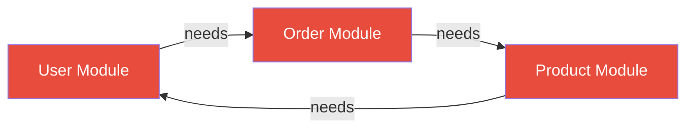
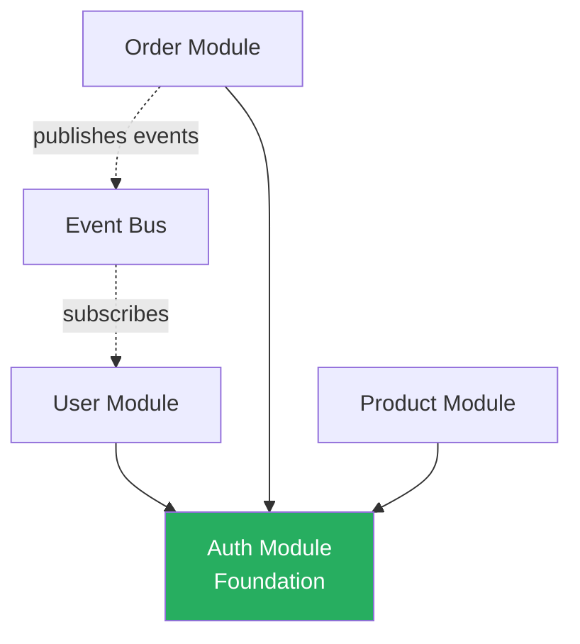

# Module Requirements Anti-Patterns

Common mistakes when designing module requirements and how to avoid them.

---

## 1. The "God Module" Anti-Pattern

### ❌ **Problem:**
One massive module that does everything.

```
Module: user
├─ Authentication
├─ Authorization
├─ User profiles
├─ User preferences
├─ Notifications
├─ Activity logs
├─ Password reset
└─ Session management
```

### ✅ **Solution:**
Break into bounded contexts (DDD):

```
Module: auth (Authentication & Authorization)
├─ Login/logout
├─ Token management
└─ RBAC

Module: user-profile (User Information)
├─ Personal info
├─ Preferences
└─ Settings

Module: notification (Communication)
├─ Email/SMS
└─ Push notifications

Module: audit (Activity Tracking)
└─ Audit logs
```

**Rule:** If module has > 15 functional requirements, consider splitting.

---

## 2. Circular Dependencies Anti-Pattern

### ❌ **Problem:**
Modules depend on each other (impossible to deploy independently).



### ✅ **Solution:**
Extract shared dependencies or use events:



**Rule:** Dependencies should form a DAG (Directed Acyclic Graph).

**Detection:**
```
Check: Can module A be deployed without module B?
If NO → You have circular dependency
```

---

## 3. Leaky Tenant Isolation

### ❌ **Problem:**
Missing tenant_id filters in multi-tenant queries.

```sql
-- DANGEROUS: No tenant isolation
SELECT * FROM patients WHERE id = ?

-- USER FROM TENANT A CAN ACCESS TENANT B DATA!
```

```go
// BAD: No tenant context
func GetPatient(id string) (*Patient, error) {
    return db.Find("SELECT * FROM patients WHERE id = ?", id)
}
```

### ✅ **Solution:**
Always include tenant_id in queries and validation:

```sql
-- SAFE: Tenant isolated
SELECT * FROM patients 
WHERE id = ? AND tenant_id = ?
```

```go
// GOOD: Tenant-aware
func GetPatient(ctx TenantContext, id string) (*Patient, error) {
    return db.Find(
        "SELECT * FROM patients WHERE id = ? AND tenant_id = ?", 
        id, 
        ctx.TenantID,
    )
}
```

**Rule:** Every query in multi-tenant system MUST filter by tenant_id.

**Validation:**
- [ ] All entities have tenant_id field
- [ ] All queries include WHERE tenant_id = ?
- [ ] All API endpoints validate tenant_id from JWT
- [ ] Cross-tenant access tests written and passing

---

## 4. Vague Functional Requirements

### ❌ **Problem:**
Unmeasurable, untestable requirements.

```
FR-001: System should be fast
FR-002: User interface should be intuitive
FR-003: Data should be secure
FR-004: System should handle lots of users
```

### ✅ **Solution:**
Specific, measurable criteria:

```
FR-001: API response time < 500ms (p95)
FR-002: New user completes registration in < 3 minutes (measured)
FR-003: Password hashed with bcrypt cost 12, data encrypted at rest (AES-256)
FR-004: Support 10,000 concurrent users with < 2% error rate
```

**Rule:** If you can't write a test for it, it's too vague.

**Template:**
```
BAD: "System should X"
GOOD: "System must X within Y time/count with Z% success rate"
```

---

## 5. Missing Bounded Context

### ❌ **Problem:**
Unclear module ownership leads to duplicate logic.

```
patient module: Has `calculateAge()` method
visit module: Also has `calculateAge()` method
prescription module: Also has `calculateAge()` method

→ Same logic duplicated 3 times!
→ Update in one place, forgot others → BUG
```

### ✅ **Solution:**
Clear bounded context with shared utilities:

```
patient module:
  - Owns patient entity
  - Owns `calculateAge()` business logic
  
visit module:
  - Uses patient.calculateAge() via dependency
  
prescription module:
  - Uses patient.calculateAge() via dependency

OR:

shared/utils module:
  - Provides date/time utilities (calculateAge, formatDate, etc)
  - All modules depend on shared utils
```

**Rule:** Each concept owned by exactly ONE module.

---

## 6. No Multi-Tenant Strategy

### ❌ **Problem:**
Building as single-tenant, then trying to "add multi-tenancy later".

```
Entity: User {
  id: uuid
  email: string
  password: string
  // No tenant_id!
}

Query: SELECT * FROM users WHERE email = ?
// No tenant filtering!
```

**Adding multi-tenancy later requires:**
- Database schema migration (add tenant_id everywhere)
- Rewrite ALL queries
- Update ALL business logic
- Migration path for existing data
- **= Months of rework!**

### ✅ **Solution:**
Design for multi-tenancy from day 1 (even if single tenant at launch):

```
Entity: User {
  id: uuid
  tenant_id: uuid  // ← Day 1
  email: string
  password: string
}

Query: SELECT * FROM users 
WHERE email = ? AND tenant_id = ?
// Tenant-aware from start
```

**Rule:** If there's any chance of multi-tenancy in future, design for it now.

**Cost:**
- Multi-tenant from start: +10% development time
- Add multi-tenancy later: +300% development time (complete rewrite)

---

## 7. Ignoring Non-Functional Requirements

### ❌ **Problem:**
Only documenting "what" (functional), ignoring "how well" (non-functional).

```
Module: patient
FR-001: Create patient ✅
FR-002: Update patient ✅
FR-003: Delete patient ✅

// But HOW FAST? HOW SECURE? HOW MANY USERS?
```

### ✅ **Solution:**
Document NFRs alongside FRs:

```
Module: patient

Functional:
  FR-001: Create patient

Non-Functional:
  NFR-001: Create patient < 200ms (p95)
  NFR-002: Support 10,000 patients per tenant
  NFR-003: Encrypt PII data at rest
  NFR-004: Audit all patient data access
  NFR-005: 99.9% uptime SLA
```

**Required NFRs:**
- Performance (latency, throughput)
- Security (encryption, auth, audit)
- Scalability (user count, data volume)
- Reliability (uptime, error rate)
- Maintainability (code coverage, documentation)

---

## 8. Missing Integration Points

### ❌ **Problem:**
Modules designed in isolation, integration discovered during coding.

```
Module: visit
  - Creates visit record
  - ??? How to get patient data?
  - ??? How to validate user permissions?
  - ??? How to send notification?
  
→ Integration points not documented
→ Circular dependencies discovered late
→ Refactoring required
```

### ✅ **Solution:**
Document all integration points upfront:

```
Module: visit

Dependencies (This module needs):
  - patient module: Get patient details
  - auth module: Validate permissions
  - notification module: Send appointment reminder

Provides To (Other modules need this):
  - prescription module: Get visit context
  - billing module: Get visit charges
  - report module: Get visit statistics
```

**Rule:** Document integration points before writing code.

---

## 9. Overly Granular Modules

### ❌ **Problem:**
Too many tiny modules (microservices madness).

```
Module: user-email (handles only email field)
Module: user-password (handles only password)
Module: user-name (handles only name)
Module: user-phone (handles only phone)

→ 4 modules for one concept
→ 4 deployments
→ Network overhead
→ Complex debugging
```

### ✅ **Solution:**
Group related concepts into cohesive modules:

```
Module: user-profile
  - Email
  - Password
  - Name
  - Phone
  - Preferences
  
→ Single cohesive bounded context
→ One deployment
→ Simple to maintain
```

**Rule:** Module should be large enough to be useful, small enough to be understandable.

**Guideline:** 5-15 functional requirements per module is typical.

---

## 10. No Validation Rules

### ❌ **Problem:**
Missing or vague validation leads to bad data.

```
FR-001: Create user
Input: email, password
// No validation specified!

Result:
  - email = "not-an-email" ✅ Accepted
  - password = "123" ✅ Accepted
  - Bad data in database!
```

### ✅ **Solution:**
Explicit validation rules:

```
FR-001: Create user

Validation Rules:
| Field    | Rules | Error Message |
|----------|-------|---------------|
| email    | Required, Email format, Max 100, Unique within tenant | "Valid email required (max 100 chars)" |
| password | Required, Min 8, 1 uppercase, 1 number, 1 special | "Password must be 8+ chars with 1 uppercase, 1 number, 1 special" |
| tenant_id | Required, Valid UUID, Tenant must be active | "Valid tenant required" |
```

**Rule:** Every input field needs validation rules + error messages.

---

## 11. Ignoring Error Handling

### ❌ **Problem:**
No error codes, generic error messages.

```
User tries to login with wrong password:
  Response: "Error"
  
User locked out after 5 attempts:
  Response: "Error"
  
Tenant inactive:
  Response: "Error"
  
→ User has no idea what went wrong!
```

### ✅ **Solution:**
Specific error codes and user-friendly messages:

```
| Code | HTTP | Description | User Message |
|------|------|-------------|--------------|
| AUTH_001 | 401 | Invalid credentials | "Email or password incorrect" |
| AUTH_005 | 429 | Too many attempts | "Too many failed attempts. Try again in 15 minutes" |
| AUTH_004 | 403 | Tenant inactive | "Account not active. Contact support" |
```

**Rule:** Every error condition needs:
- Unique code (for logging/debugging)
- HTTP status (for API)
- Technical description (for logs)
- User message (for UI)

---

## 12. No Performance Targets

### ❌ **Problem:**
"Make it fast" without defining "fast".

```
NFR-001: System should be responsive
NFR-002: Queries should be quick
NFR-003: Handle high load

→ Impossible to test
→ Impossible to verify
→ Impossible to optimize
```

### ✅ **Solution:**
Measurable performance targets:

```
NFR-001: API response time < 500ms (p95), < 1s (p99)
NFR-002: Database queries < 30ms (p99)
NFR-003: Support 10,000 concurrent users with < 2% error rate
NFR-004: Page load time < 2 seconds (p90)
NFR-005: Background jobs < 5 minutes (p95)
```

**Rule:** Performance targets need:
- Number + unit (ms, seconds, GB, count)
- Percentile (p50, p95, p99)
- Context (API, DB, page load)

---

## 13. Copy-Paste Entity Attributes

### ❌ **Problem:**
Every entity has different timestamp/audit fields.

```
Entity: Patient {
  created: Date       // Wrong name
  modified_date: Date // Inconsistent
}

Entity: Visit {
  createdAt: DateTime // camelCase
  updated: Timestamp  // Different type
}

Entity: Prescription {
  create_time: String // String?!
  // No updated_at!
}
```

### ✅ **Solution:**
Standardize common fields across all entities:

```
Standard Entity Template:
  id: UUID (primary key)
  tenant_id: UUID (for multi-tenant)
  created_at: Timestamp
  updated_at: Timestamp
  deleted_at: Timestamp (nullable, soft delete)
  created_by: UUID (user who created)
  updated_by: UUID (user who last updated)

All entities follow this pattern.
```

**Rule:** Standardize common fields in template, enforce in code reviews.

---

## 14. Missing Test Scenarios

### ❌ **Problem:**
No examples of inputs/outputs for testing.

```
FR-AUTH-001: User login
// That's it... no test cases!

→ Developer guesses implementation
→ QA guesses test cases
→ Different interpretations
→ Bugs
```

### ✅ **Solution:**
Concrete test scenarios with inputs/outputs:

```
FR-AUTH-001: User login

Test Scenario 1: Successful Login
Input:
  - email: "doctor@clinic.com"
  - password: "SecureP@ss123"
  - tenant_id: "valid-tenant-uuid"
Expected Output:
  - HTTP 200 OK
  - access_token returned (JWT)
  - Token contains tenant_id claim

Test Scenario 2: Invalid Password
Input:
  - email: "doctor@clinic.com"
  - password: "wrong-password"
  - tenant_id: "valid-tenant-uuid"
Expected Output:
  - HTTP 401 Unauthorized
  - Error code: AUTH_001
  - Message: "Email or password incorrect"
```

**Rule:** At least 2 test scenarios per FR (happy path + error case).

---

## Quick Anti-Pattern Checklist

Before finalizing module requirements, check:

- [ ] ❌ Module has > 20 FRs → **God Module** - Split it
- [ ] ❌ Module A depends on B, B depends on A → **Circular Dependency** - Break cycle
- [ ] ❌ Queries don't include tenant_id → **Leaky Isolation** - Add tenant filters
- [ ] ❌ FRs say "should be fast/secure/good" → **Vague Requirements** - Add numbers
- [ ] ❌ Multiple modules own same concept → **No Bounded Context** - Clarify ownership
- [ ] ❌ No tenant_id in entities → **No Multi-Tenant Strategy** - Add now
- [ ] ❌ No performance/security NFRs → **Missing NFRs** - Document them
- [ ] ❌ No integration points documented → **Missing Integration** - Document dependencies
- [ ] ❌ < 3 FRs per module → **Too Granular** - Consider merging
- [ ] ❌ No validation rules → **Bad Data Risk** - Specify validation
- [ ] ❌ Generic error messages → **No Error Handling** - Define error codes
- [ ] ❌ "Fast" without numbers → **No Performance Targets** - Add measurable targets
- [ ] ❌ Inconsistent entity fields → **Copy-Paste** - Standardize template
- [ ] ❌ No test scenarios → **Untestable** - Add input/output examples

**Passing Score:** 0 checks failed = Ready to proceed ✅

---

**End of Anti-Patterns Guide**
