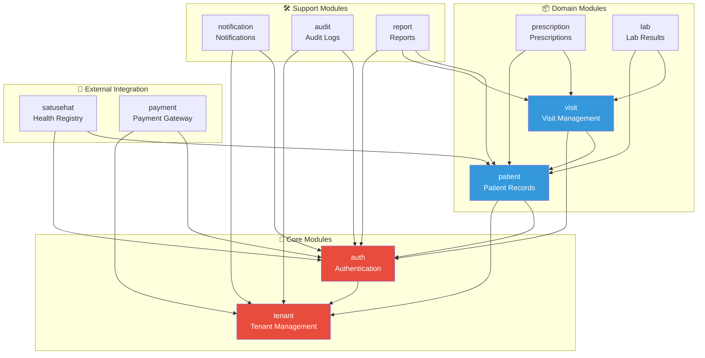
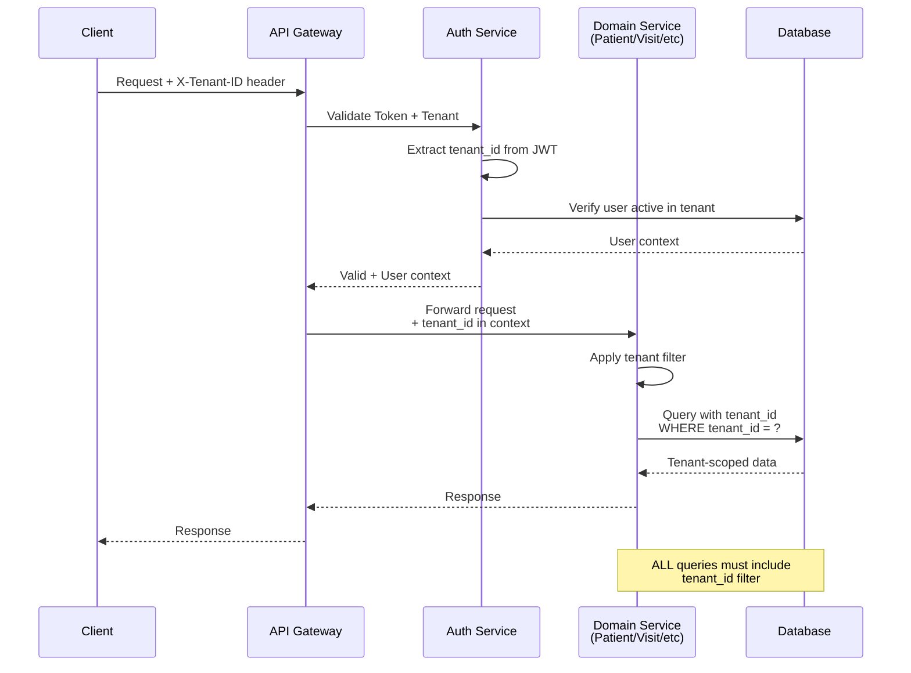
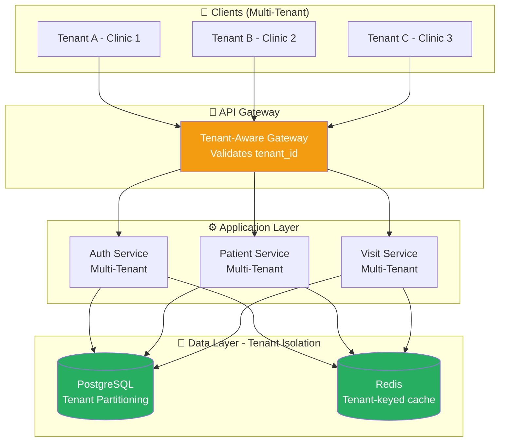
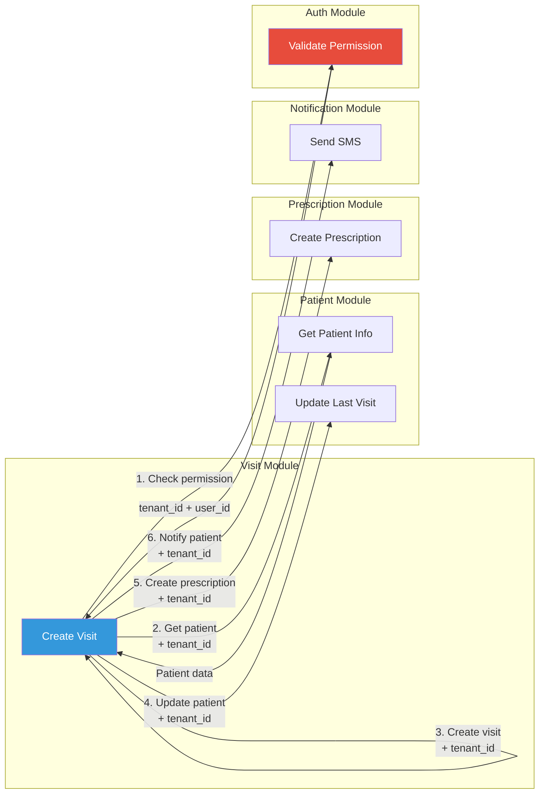
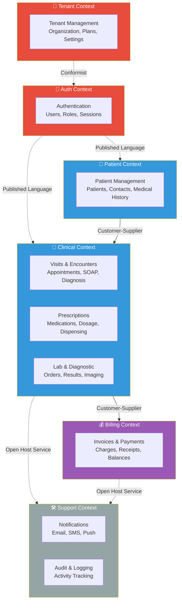
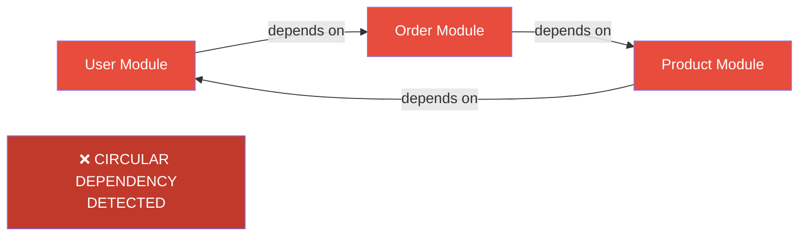
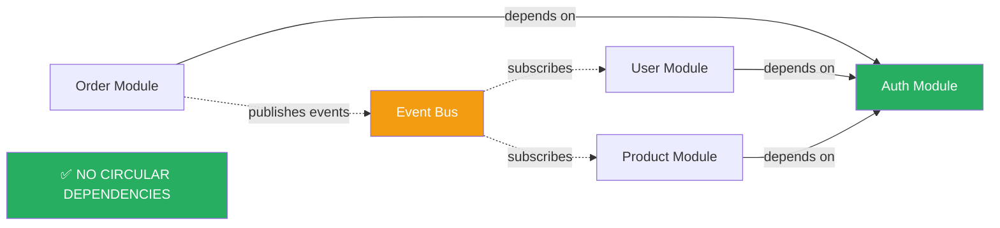
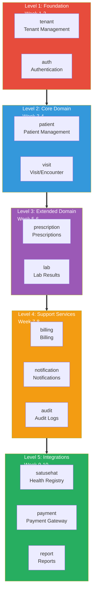
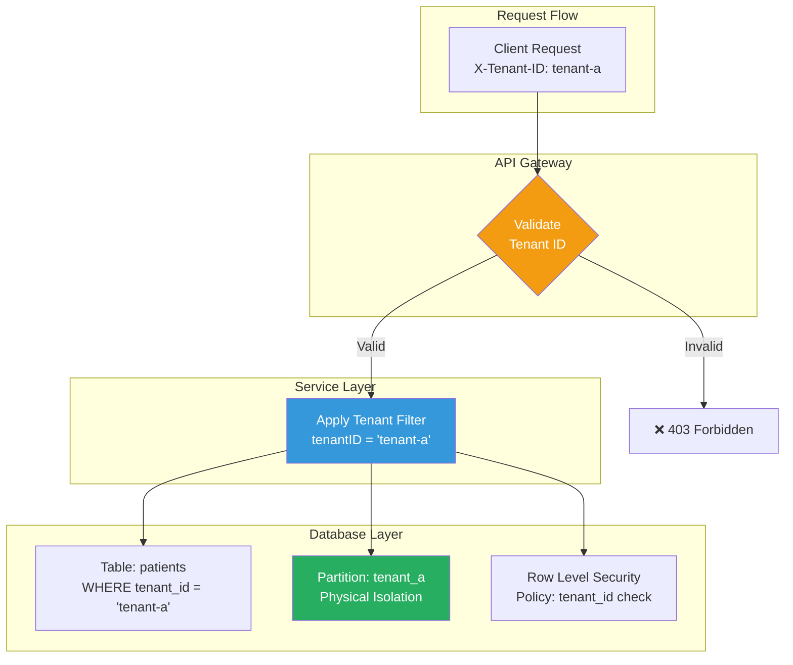

# Module Dependency Diagram Templates

Visualize module dependencies and interactions for multi-tenant systems.

---

## 1. Module Dependency Graph

Shows which modules depend on which (for dependency injection planning).



**How to Use:**
1. Identify Core modules (no dependencies or minimal)
2. Add Domain modules (business logic)
3. Add Support modules (cross-cutting concerns)
4. Show dependency arrows (A → B means "A depends on B")
5. Verify no circular dependencies

---

## 2. Tenant Context Flow

Shows how tenant context propagates through the system.



---

## 3. Multi-Tenant Architecture Layers

Shows system layers with tenant isolation.



---

## 4. Module Interaction (Cross-Module Communication)

Shows how modules communicate while maintaining tenant context.



**Key Principle:** Every cross-module call includes tenant_id

---

## 5. Bounded Context Map (DDD)

Shows module boundaries and relationships.



**Relationship Types:**
- **Conformist (dotted)**: Downstream conforms to upstream
- **Customer-Supplier (solid)**: Upstream serves downstream
- **Open Host Service (dotted)**: Shared service for multiple contexts

---

## 6. Circular Dependency Detection

Example of BAD design (circular dependencies).



**Solution:** Break cycle with dependency inversion or event-driven approach.



---

## 7. Module Maturity Levels (Implementation Order)

Shows recommended implementation sequence.



---

## 8. Tenant Isolation Strategy

Shows data isolation at different layers.



**Isolation Strategies:**
1. **Application-Level**: Service layer applies tenant filter (most common)
2. **Partition-Level**: Physical table partitioning by tenant_id
3. **Row-Level Security**: PostgreSQL RLS policies (defense in depth)

---

## Usage Tips

### Embedding in Requirements

```markdown
## 9. Module Dependencies

### Dependency Graph

\`\`\`mermaid
flowchart TD
    ... (copy diagram here)
\`\`\`

### Tenant Context Flow

\`\`\`mermaid
sequenceDiagram
    ... (copy diagram here)
\`\`\`
```

### Best Practices

1. **Start simple** - Begin with Level 1 foundation modules
2. **Avoid cycles** - Use dependency detection diagram to validate
3. **Document context** - Show how tenant_id propagates
4. **Show layers** - Separate concerns (auth, domain, support)
5. **Implementation order** - Use maturity levels to plan sprints

### Recommended Diagrams per Phase

| Phase | Recommended Diagram |
|-------|---------------------|
| Module Planning | Module Dependency Graph, Bounded Context Map |
| Architecture Review | Multi-Tenant Architecture Layers |
| Implementation | Module Maturity Levels |
| Validation | Circular Dependency Detection |
| Documentation | Module Interaction, Tenant Context Flow |

---

## Multi-Tenant Checklist

Use this when designing module dependencies for multi-tenant systems:

- [ ] Every module has access to tenant_id context
- [ ] All database queries include tenant_id filter
- [ ] Cross-module calls include tenant_id parameter
- [ ] Auth module validates tenant_id in tokens
- [ ] No circular dependencies between modules
- [ ] Core modules (tenant, auth) have no domain dependencies
- [ ] Tenant isolation tested (cross-tenant access prevention)
