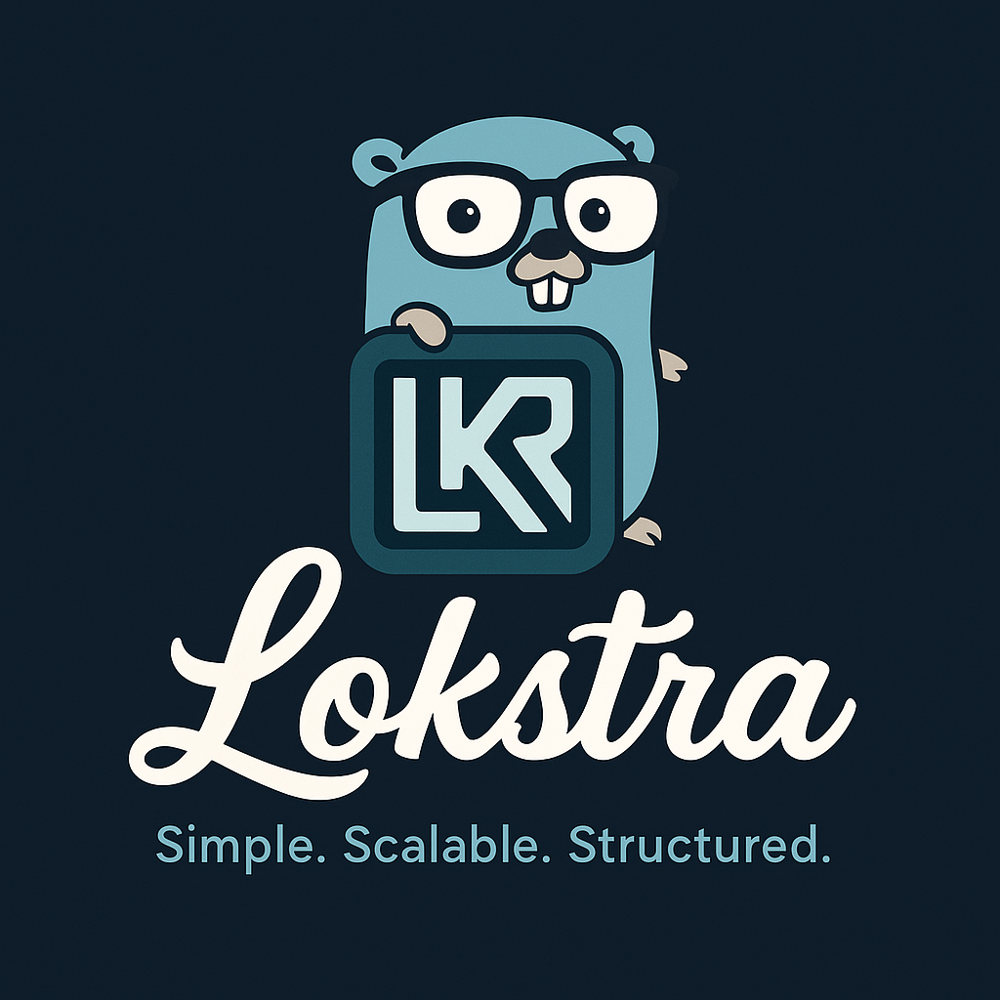

# Lokstra ⚡

<p align="center">
	
</p>

> Lightweight Go backend framework for monoliths and microservices.

📘 [Positioning Statement](./POSITIONING.md) — What Lokstra *is* and *is not*  
📈 [Milestone & Roadmap](./MILESTONE.md) — Development plan and upcoming features

---

## ✨ Overview

**Lokstra** is a modular backend framework written in Go, designed for building scalable APIs and backend services with minimal boilerplate. Lokstra supports monolithic and microservice architectures out of the box, with a focus on fast development, clean structure, and runtime flexibility.

Whether you're building a SaaS platform, internal tools, or event-driven systems, Lokstra adapts to your structure — not the other way around.

---

## 🧭 Philosophy

> **Opinionated, Not Restrictive**

Lokstra offers a clear project structure and batteries-included features, but never locks you in. You are free to override core behavior, plug in your own services, or deploy with your preferred stack — from Docker to Kubernetes, from monolith to distributed services.

---

## 🚀 Features

### ⚙️ Core Architecture

- ✅ Clean hierarchy: **Server → App → Router**
- ✅ Each App runs independently on its own port
- ✅ Grouped routing with prefixing & method chaining
- ✅ Custom `RequestContext` with embedded response control

### 📦 Deployment Modes

- ✅ Monolith, multi-binary, or multi-config deployment
- ✅ Flexible CLI entrypoints
- ✅ Easy Docker and K8s integration
- ✅ Graceful shutdown built-in

### 🧠 Services & Extensibility

- ✅ Built-in services: Logger, DB, Redis, JWT, Metrics
- ✅ Easy service creation via `RegisterService` or YAML
- ✅ Override, disable, or extend services as needed

### 🛡️ Middleware Engine

- ✅ Middleware levels: global, group, handler
- ✅ Built-in middleware: CORS, recovery, request logging
- ✅ Custom middleware factories (YAML/Go)
- ✅ Group isolation and override support

### 🧰 Developer Experience

- ✅ Fast binding with minimal reflection
- ✅ Error response helpers and status shortcuts
- ✅ Config via **YAML**, **code**, or hybrid
- ✅ Modular, clean file structure
- ✅ Optional `ContextHelper` injection for DX

### 🌍 Multi-Tenant Ready

- ✅ Tenant-aware DB and Redis connection factories
- ✅ Supports isolated schema or shared table per tenant
- ✅ Easy access via `getDbConnection(tenantId, name)`

---

## 🧱 Directory Structure

```
lokstra/
├── common/         # Common: customtype, json, utils
├── core/           # Core: app, config, meta, midware, registration, 
|                           request, response, router, server, service
├── middleware/     # Built-in middleware
├── modules/        # Built-in modules
├── serviceapi/     # Service interface declaration
├── services/       # Built-in services
├── cmd/examples/   # Example apps using Lokstra
├── docs/           # Documentation & tutorials
├── go.mod
├── LICENSE
└── README.md
```

---

## 📂 Example: Minimal App

```go
package main

import "github.com/primadi/lokstra"

func main() {
	regCtx := lokstra.NewGlobalRegistrationContext()

	srv := lokstra.NewServer(regCtx, "my-server")
	app := lokstra.NewApp(regCtx, "app1", ":8080")

	app.GET("/hello", func(ctx *lokstra.Context) error {
		return ctx.Ok("Hello From Lokstra")
	})

	srv.AddApp(app)
	_ = srv.Start()
}
```

---

## 🧩 Built-in & Planned Services

Lokstra includes plug-and-play services with minimal config:

- [x] Logger (zero-dependency `zerolog`)
- [x] Redis connection pool
- [x] PostgreSQL connection pool (via `pgx`)
- [x] Prometheus metrics (custom + built-in)
- [x] JWT Authenticator
- [ ] Email sender
- [ ] WebSocket pub/sub engine
- [ ] Background task queue / worker
- [ ] RBAC + permission manager

---

## 🧪 Examples

Lokstra includes categorized and progressive examples to help developers explore step-by-step.

📂 See full details in [`cmd/examples/README.md`](cmd/examples/README.md)

### Chapters:

1. **Basic Overview** – From minimal router to YAML-configured server  
2. **Router Features** – Group, mount, and middleware examples  
3. **Best Practices** – Custom context, naming, config splitting  
4. **Customization** – Override JSON, response, router engine  
5. **Business Services** – Domain-driven services like ledger, loan, etc.  
6. **Default Services** – Logger, DBPool, Redis, JWT, Metrics, etc.  
7. **Default Middleware** – Recovery, CORS, logging, JWT, etc.

> 💡 Each example is self-contained and runnable, with inline documentation.

---

## 🔭 Roadmap

- [ ] Full middleware stack with YAML loader
- [ ] WebSocket + async command/response
- [ ] Service lifecycle & dependency injection
- [ ] Web UI (React + Mantine) scaffold
- [ ] Plugin architecture for domain modules
- [ ] Multi-tenant admin dashboard
- [ ] RBAC UI + user management
- [ ] CLI tool: `loktra init server`, `lokstra lint`, etc.

---

## 📜 License

Lokstra is licensed under the [Apache License 2.0](LICENSE).

---

## 🙌 Contributing

Lokstra is currently in active development and will open for contributions soon.  
Stay tuned for the public release and contributor onboarding!

For contributions or roadmap discussions, please open an issue or submit a pull request on GitHub.  
Thank you for supporting Lokstra!
