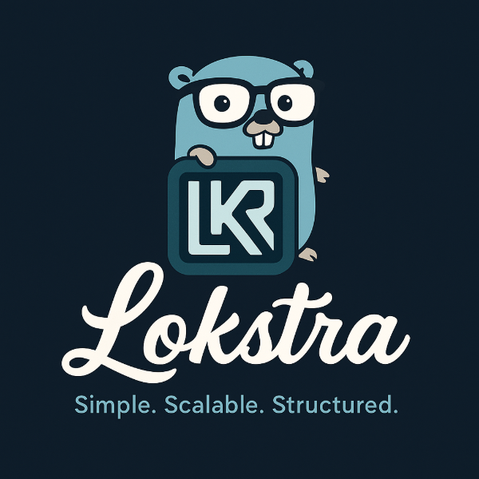

# Lokstra

<div align="center">
  
  <h3>Modern Go Web Framework with Declarative Service Management</h3>
  <p>
    <a href="https://primadi.github.io/lokstra/">Documentation</a> •
    <a href="#quick-start">Quick Start</a> •
    <a href="#features">Features</a> •
    <a href="https://primadi.github.io/lokstra/00-introduction/examples/">Examples</a>
  </p>
</div>

---

## What is Lokstra?

Lokstra is a **versatile Go web framework** that works in two ways:

### 🎯 As a Router (Like Echo, Gin, Chi)
Use Lokstra as a fast, flexible HTTP router with elegant middleware support.

```go
r := lokstra.NewRouter("api")
r.GET("/", func() string {
    return "Hello, Lokstra!"
})
app := lokstra.NewApp("hello", ":3000", r)
app.Run(30 * time.Second)
```

### 🏗️ As a Framework (Like NestJS, Spring Boot)
Leverage lazy dependency injection, auto-generated routers, and configuration-driven deployment.

```go
// Type-safe lazy DI
var userService = service.LazyLoad[*UserService]("user-service")

func handler() {
    users := userService.MustGet().GetAll()
}
```

---

## Quick Start

### 🚀 Using Lokstra CLI (Recommended)

**1. Install CLI:**
```bash
go install github.com/primadi/lokstra/cmd/lokstra@latest
```

**2. Create Project:**
```bash
# Interactive template selection
lokstra new myapp

# Or choose specific template
lokstra new blog-api -template 02_app_framework/01_medium_system
```

**3. Run:**
```bash
cd myapp
go run .
```

**Done!** Your app is running with routes already set up.

### 📦 Using as Library

```bash
go get github.com/primadi/lokstra
```

```go
package main

import "github.com/primadi/lokstra"

func main() {
    r := lokstra.NewRouter("api")
    r.GET("/", func() string {
        return "Hello, Lokstra!"
    })
    
    app := lokstra.NewApp("hello", ":3000", r)
    app.Run(30 * time.Second)
}
```

---

## Features

### ⚡ Lokstra CLI
- 📦 **6+ Production Templates** - Router patterns & enterprise frameworks
- 🔧 **Auto-fix Imports** - No manual configuration needed
- 🚀 **Code Generation** - Built-in `autogen` command for annotation-based templates
- 🌐 **Always Updated** - Templates downloaded from GitHub

```bash
lokstra new myapp                           # Interactive
lokstra new myapp -template 01_router/...   # Specific template
lokstra autogen ./myproject                 # Generate code
```

### 🎯 Lazy Dependency Injection
Type-safe service loading with zero overhead:

```go
var db = service.LazyLoad[*Database]("database")
users := db.MustGet().GetAll()  // Loaded once, cached forever
```

### 🔄 Auto-Generated Routers
Generate REST APIs from service definitions:

```yaml
service-definitions:
  user-service:
    type: user-service-factory

deployments:
  production:
    servers:
      api:
        published-services: [user-service]  # Auto-creates REST router!
```

### 🏗️ Flexible Deployment
One codebase, multiple topologies:

```yaml
# Monolith
servers:
  all-in-one:
    published-services: [user-service, order-service]

# Microservices
servers:
  user-api:
    published-services: [user-service]
  order-api:
    published-services: [order-service]
```

### 📝 Type-Safe Request Binding
Automatic validation with struct tags:

```go
type CreateUserParams struct {
    Name  string `json:"name" validate:"required"`
    Email string `json:"email" validate:"required,email"`
}

func createUser(ctx *request.Context, params *CreateUserParams) error {
    // params already validated!
    user := db.CreateUser(params.Name, params.Email)
    return ctx.Api.Ok(user)
}
```

---

## CLI Templates

### Router Patterns
- **01_router/01_router_only** - Pure routing basics
- **01_router/02_single_app** - Production single app
- **01_router/03_multi_app** - Multiple apps server

### Framework Patterns
- **02_app_framework/01_medium_system** - Domain-driven (2-10 entities)
- **02_app_framework/02_enterprise_modular** - DDD with bounded contexts
- **02_app_framework/03_enterprise_router_service** - Annotation-based enterprise

[📖 View All Templates →](./project_templates/)

---

## Documentation

- 📘 **[Full Documentation](https://primadi.github.io/lokstra/)** - Complete guide
- 🤖 **[AI Agent Guide](https://primadi.github.io/lokstra/AI-AGENT-GUIDE)** - For AI assistants (Copilot, Claude, ChatGPT)
- ⚡ **[Quick Reference](https://primadi.github.io/lokstra/QUICK-REFERENCE)** - Cheatsheet for common patterns
- 🚀 **[Quick Start](https://primadi.github.io/lokstra/00-introduction/)** - Get started in 5 minutes
- 🎯 **[Router Guide](https://primadi.github.io/lokstra/01-router-guide/)** - Use as router (like Echo/Gin)
- 🏗️ **[Framework Guide](https://primadi.github.io/lokstra/02-framework-guide/)** - Full framework (like NestJS)
- 💡 **[Examples](https://primadi.github.io/lokstra/00-introduction/examples/)** - Working code samples
- 📚 **[API Reference](https://primadi.github.io/lokstra/03-api-reference/)** - Technical docs
- ⚡ **[CLI Documentation](./cmd/lokstra/)** - CLI tool usage

---

## Why Lokstra?

### vs Traditional Routers (Echo, Gin, Chi)
✅ **29+ handler signatures** - Ultimate flexibility  
✅ **Clean middleware** - Easy to compose  
✅ **Type-safe DI** - Optional, when you need it  
✅ **Auto-generated routes** - From services  

### vs DI Frameworks (Fx, Wire, Dig)
✅ **Type-safe** - No `any` casting  
✅ **Zero reflection** - In hot path  
✅ **Lazy loading** - Memory efficient  
✅ **Optional config** - Start with code, scale with YAML  

### vs Full Frameworks (NestJS, Spring Boot)
✅ **Simpler** - No decorators, no code generation required  
✅ **Flexible** - Use as router OR framework  
✅ **Go-native** - Idiomatic Go patterns  
✅ **Deployment agnostic** - Monolith → microservices without code changes  

---

## Project Structure

```
lokstra/
├── cmd/lokstra/              # CLI tool for scaffolding
├── core/                     # Core framework
│   ├── deploy/              # Deployment & config
│   ├── registry/            # Service registry
│   ├── request/             # Request handling
│   └── router/              # HTTP routing
├── project_templates/        # Project templates
│   ├── templates.json       # Template registry
│   ├── 01_router/          # Router patterns
│   └── 02_app_framework/   # Framework patterns
├── services/                # Built-in services
├── middleware/              # Standard middleware
└── docs/                    # Documentation site
```

---

## Community & Support

- 📖 **[Documentation](https://primadi.github.io/lokstra/)**
- 💡 **[Examples](https://primadi.github.io/lokstra/00-introduction/examples/)**
- 🐛 **[Issues](https://github.com/primadi/lokstra/issues)**
- 🗺️ **[Roadmap](./docs/ROADMAP.md)**

---

## License

Apache 2.0 License - see [LICENSE](./LICENSE) file for details.

---

<div align="center">
  <p>Made with ❤️ by <a href="https://github.com/primadi">Primadi</a></p>
  <p>
    <a href="https://github.com/primadi/lokstra">⭐ Star on GitHub</a>
  </p>
</div>
