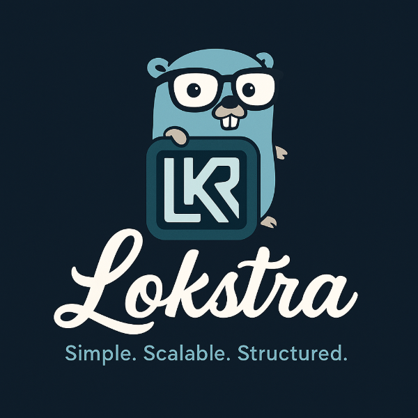

<div align="center">
  
  <h1>Lokstra</h1>
  <p><strong>Modern Go Web Framework with Declarative Service Management</strong></p>
  <p>
    <a href="#quick-start">Quick Start</a> •
    <a href="#key-features">Features</a> •
    <a href="#examples">Examples</a> •
    <a href="./01-essentials/">Documentation</a> •
    <a href="https://github.com/primadi/lokstra">GitHub</a>
  </p>
</div>

---

## What is Lokstra?

Lokstra is a **production-ready Go web framework** that combines the simplicity of manual coding with the power of declarative configuration. Build scalable applications with **lazy dependency injection**, **auto-generated routers**, and **flexible deployment topologies**.

```go
// Define services in YAML
service-definitions:
  user-service:
    type: user-service-factory
    depends-on: [database]

// Or use them directly in code
userService := service.LazyLoad[*UserService]("user-service")
users := userService.MustGet().GetAll()
```

Perfect for:
- 🚀 **Startups**: Start simple, scale declaratively
- 🏢 **Enterprises**: Type-safe DI with YAML configuration
- 🔄 **Microservices**: Multi-deployment support (monolith → microservices)
- 📦 **API Services**: Auto-generated REST routers from services

---

## Quick Start

### Install
```bash
go get github.com/primadi/lokstra
```

### Hello World (30 seconds)
```go
package main

import "github.com/primadi/lokstra"

func main() {
    r := lokstra.NewRouter("api")
    
    r.GET("/", func() string {
        return "Hello, Lokstra!"
    })
    
    r.GET("/ping", func() string {
        return "pong"
    })
    
    app := lokstra.NewApp("hello", ":3000", r)
    app.Run(30 * time.Second)
}
```

### With Services & Configuration (2 minutes)

**1. Define configuration** (`config.yaml`):
```yaml
service-definitions:
  user-service:
    type: user-service-factory

deployments:
  production:
    servers:
      api:
        base-url: https://api.example.com
        addr: ":8080"
        published-services: [user-service]
```

**2. Register factory** (one-time setup):
```go
lokstra_registry.RegisterServiceType("user-service-factory", 
    func() any { return service.NewUserService() })
```

**3. Use anywhere** (zero overhead after first access):
```go
var userService = service.LazyLoad[*UserService]("user-service")

func handler() {
    users := userService.MustGet().GetAll()  // Loaded once, cached forever
}
```

**[👉 Full Tutorial](./01-essentials/)**

---

## Key Features

### 🎯 Lazy Dependency Injection
Type-safe service loading with zero overhead. Services created only when needed.

```go
// Define once, use everywhere
var db = service.LazyLoad[*Database]("database")
var cache = service.LazyLoad[*Cache]("cache")

// Loaded on first access, cached forever
users := db.MustGet().GetAll()
```

**Benefits:**
- No initialization order issues
- Thread-safe via `sync.Once`
- Memory efficient
- Fail-fast with clear errors

**[Learn More →](./01-essentials/02-service/)**

---

### 🔄 Auto-Generated Routers
Generate REST APIs from service definitions automatically.

```yaml
service-definitions:
  user-service:
    type: user-service-factory

deployments:
  production:
    servers:
      api:
        published-services: [user-service]  # Auto-creates REST router!
```

**Generated routes:**
```
GET    /users       → List all users
GET    /users/{id}  → Get user by ID
POST   /users       → Create user
PUT    /users/{id}  → Update user
DELETE /users/{id}  → Delete user
```

**With overrides:**
```yaml
router-definitions:
  user-service-router:
    path-prefix: /api/v1
    path-rewrites:
      - pattern: "^/api/v1/(.*)$"
        replacement: "/api/v2/$1"
    middlewares: [auth, logging]
    hidden: [InternalMethod]
```

**[Learn More →](./03-api-reference/02-registry/router-registration.md)**

---

### 🏗️ Flexible Deployment Topologies
One codebase, multiple deployment strategies. Switch from monolith to microservices without code changes.

**Monolith:**
```yaml
deployments:
  production:
    servers:
      all-in-one:
        base-url: https://api.example.com
        published-services: [user-service, order-service, payment-service]
```

**Microservices:**
```yaml
deployments:
  production:
    servers:
      user-api:
        base-url: https://user-api.example.com
        published-services: [user-service]
      
      order-api:
        base-url: https://order-api.example.com
        published-services: [order-service]
```

**Same code, different topology!**

**[Learn More →](./00-introduction/examples/04-multi-deployment/)**

---

### 🛣️ Path Rewrites & Overrides
Powerful URL transformation without touching code.

```yaml
router-definitions:
  api-router:
    path-rewrites:
      - pattern: "^/api/v1/(.*)$"
        replacement: "/api/v2/$1"
    middlewares: [auth, rate-limiter]
```

**Use cases:**
- API versioning
- Multi-tenant paths
- A/B testing
- Legacy URL migration

**[Learn More →](./03-api-reference/03-configuration/schema.md#path-rewrites)**

---

### 📝 Type-Safe Request Binding
Automatic validation with struct tags. Lokstra automatically injects and validates parameters.

```go
type CreateUserParams struct {
    Name  string `json:"name" validate:"required"`
    Email string `json:"email" validate:"required,email"`
    Age   int    `json:"age" validate:"min=18,max=100"`
}

// Parameters automatically injected and validated!
func createUser(ctx *request.Context, params *CreateUserParams) error {
    // params are already validated and ready to use
    user := db.CreateUser(params.Name, params.Email, params.Age)
    return ctx.Api.Success(user)
}
```

**No manual binding code needed!** Lokstra handles:
- JSON/Form parsing
- Validation via struct tags
- Clear error messages on failure

**[Learn More →](./01-essentials/03-routing/)**

---

## Examples

### 📚 [Introduction & Examples](./00-introduction/)

**Quick Examples** - Get started in minutes:
- **[Hello World](./00-introduction/examples/01-hello-world/)** - Minimal 10-line setup
- **[JSON API](./00-introduction/examples/02-json-api/)** - REST API responses
- **[CRUD API](./00-introduction/examples/03-crud-api/)** - Complete service example with lazy DI
- **[Multi-Deployment](./00-introduction/examples/04-multi-deployment/)** - Monolith vs microservices

**Comparing Approaches:**
- **[Code vs Config](./00-introduction/CODE-VS-CONFIG.md)** - When to use which approach
- **[Architecture Overview](./00-introduction/architecture.md)** - Framework design principles

---

### 🎓 [Essential Guides](./01-essentials/)

**Step-by-step learning path:**

1. **[Quick Start](./01-essentials/01-quick-start/)** - Get up and running in 5 minutes
2. **[Service Management](./01-essentials/02-service/)** - Master lazy dependency injection
3. **[Routing & Handlers](./01-essentials/03-routing/)** - Request handling patterns
4. **[Configuration](./01-essentials/04-configuration/)** - YAML setup and environment management

Each guide includes:
- Clear explanations
- Working code examples
- Best practices
- Common pitfalls to avoid

---

### 📖 [API Reference](./03-api-reference/)

**Complete technical documentation:**

- **[Registry API](./03-api-reference/02-registry/)**
  - [Service Registration](./03-api-reference/02-registry/service-registration.md)
  - [Router Registration](./03-api-reference/02-registry/router-registration.md)
  
- **[Configuration](./03-api-reference/03-configuration/)**
  - [YAML Schema](./03-api-reference/03-configuration/schema.md) - Complete reference
  - [Deployment Patterns](./03-api-reference/03-configuration/deploy.md) - Topology strategies

**Advanced Topics:**
- Auto-generated routers
- Path rewrites & overrides
- Multi-environment deployments
- Remote service integration

---

## Why Lokstra?

### vs Traditional DI Frameworks
- ✅ **Type-safe** with generics (no `interface{}` casting)
- ✅ **Zero reflection** overhead in hot path
- ✅ **Optional YAML** (start with code, scale with config)
- ✅ **No code generation** required

### vs Manual Dependency Management
- ✅ **No initialization order issues**
- ✅ **Declarative service definitions**
- ✅ **Environment-based configuration**
- ✅ **Easy testing** (mock via registry)

### vs Other Go Frameworks
- ✅ **Lazy loading** by default (memory efficient)
- ✅ **Auto-generated routers** from services
- ✅ **Multi-deployment** support (monolith → microservices)
- ✅ **Path rewrites** via YAML (no code changes)

---

## Community & Support

- 📖 **[Full Documentation](./README.md)** - Complete guide
- 💡 **[Examples](./00-introduction/examples/)** - Working code samples
- 🐛 **[GitHub Issues](https://github.com/primadi/lokstra/issues)** - Bug reports & features
- 🗺️ **[Roadmap](./ROADMAP.md)** - Upcoming features

---

## Quick Links

<div style="display: grid; grid-template-columns: repeat(auto-fit, minmax(250px, 1fr)); gap: 1rem; margin: 2rem 0;">
  <div style="padding: 1rem; border: 1px solid #444; border-radius: 4px; background: #1a1a1a;">
    <h3>🚀 Quick Start</h3>
    <p>New to Lokstra? Start here!</p>
    <a href="./01-essentials/01-quick-start/">Get Started in 5 Minutes →</a>
  </div>
  
  <div style="padding: 1rem; border: 1px solid #444; border-radius: 4px; background: #1a1a1a;">
    <h3>📚 Examples</h3>
    <p>Learn by doing</p>
    <a href="./00-introduction/examples/">Browse Working Examples →</a>
  </div>
  
  <div style="padding: 1rem; border: 1px solid #444; border-radius: 4px; background: #1a1a1a;">
    <h3>🎓 Essential Guides</h3>
    <p>Master core concepts</p>
    <a href="./01-essentials/">Learning Path →</a>
  </div>
  
  <div style="padding: 1rem; border: 1px solid #444; border-radius: 4px; background: #1a1a1a;">
    <h3>📖 API Reference</h3>
    <p>Complete documentation</p>
    <a href="./03-api-reference/">Technical Docs →</a>
  </div>
  
  <div style="padding: 1rem; border: 1px solid #444; border-radius: 4px; background: #1a1a1a;">
    <h3>🔧 Configuration</h3>
    <p>YAML schema & patterns</p>
    <a href="./03-api-reference/03-configuration/schema.md">Schema Reference →</a>
  </div>
  
  <div style="padding: 1rem; border: 1px solid #444; border-radius: 4px; background: #1a1a1a;">
    <h3>🏗️ Architecture</h3>
    <p>Design principles</p>
    <a href="./00-introduction/architecture.md">Framework Design →</a>
  </div>
</div>

---

<div align="center">
  <p>Made with ❤️ by <a href="https://github.com/primadi">Primadi</a></p>
  <p>
    <a href="https://github.com/primadi/lokstra">⭐ Star on GitHub</a> •
    <a href="https://github.com/primadi/lokstra/blob/main/LICENSE">MIT License</a>
  </p>
</div>
