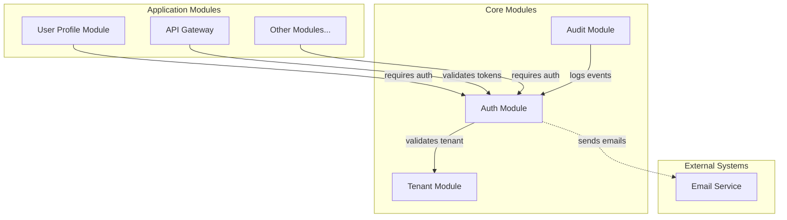
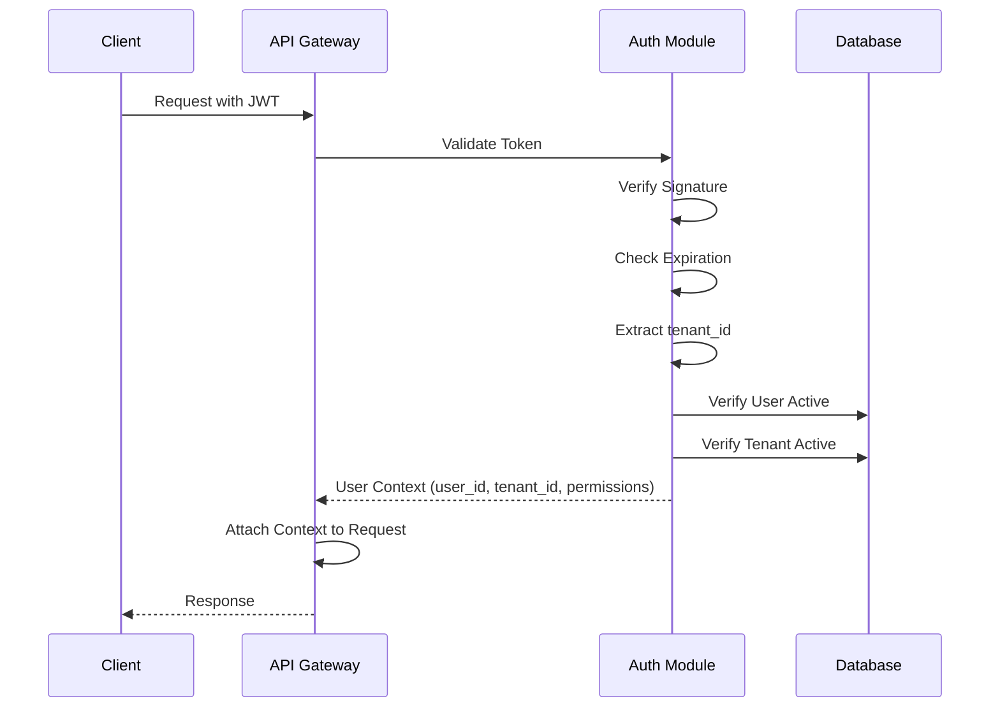
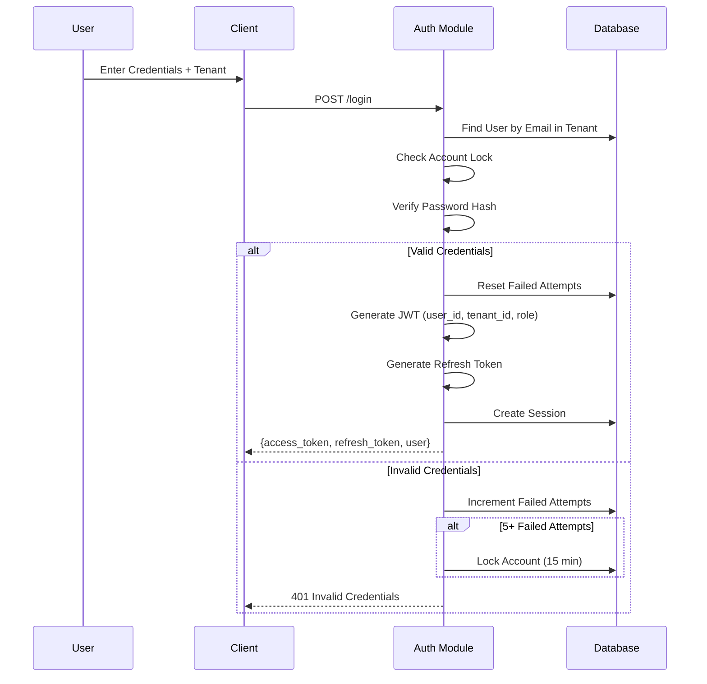
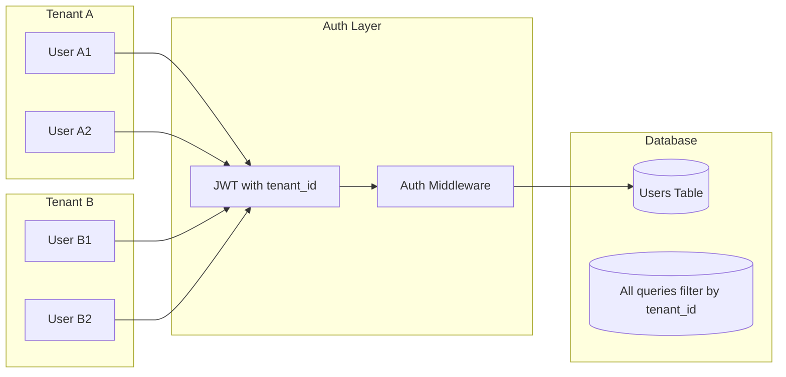
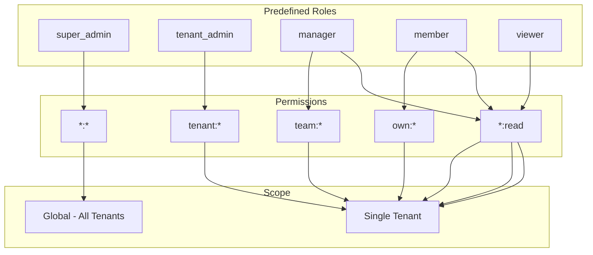
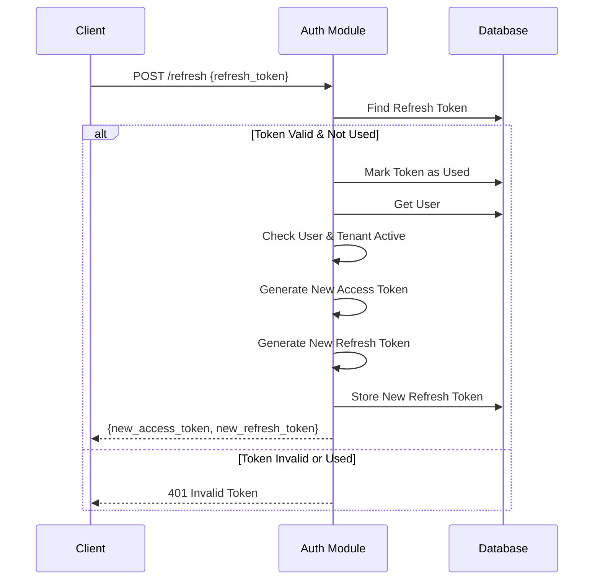
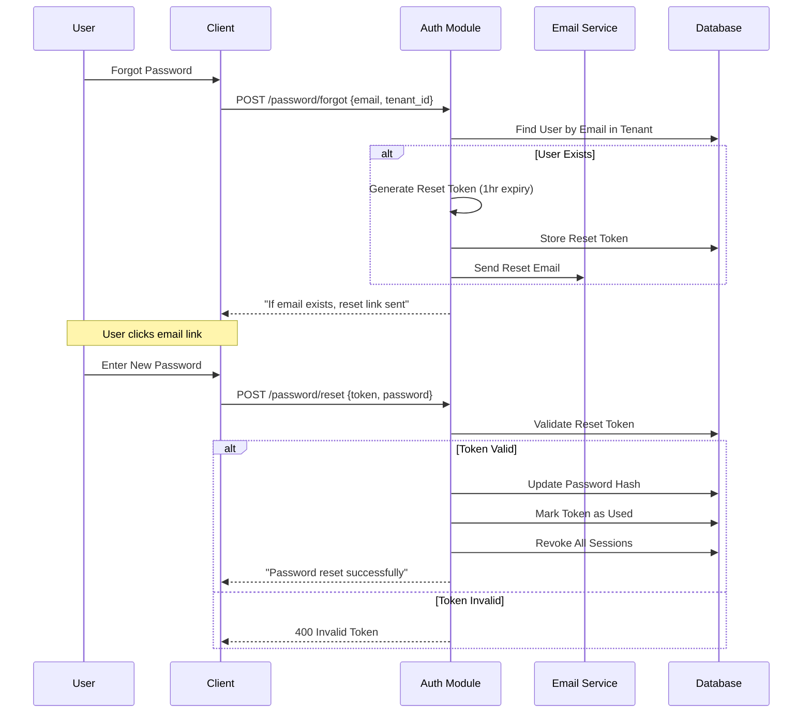

# Auth Module - Dependency Diagram

This document shows the dependency relationships for the auth module in a multi-tenant SaaS application.

## Module Dependency Graph

## Tenant Context Flow

## Authentication Flow

## Multi-Tenant Data Flow

## RBAC Permission Model

## Token Refresh Flow

## Password Reset Flow

## Integration Points Summary

| Module | Direction | Purpose | Data Exchanged |
|--------|-----------|---------|----------------|
| Tenant | Auth → Tenant | Validate tenant status | tenant_id → tenant info |
| Notification | Auth → Notification | Send emails | email data → delivery status |
| API Gateway | Gateway → Auth | Validate requests | token → user context |
| All Modules | Module → Auth | Authorization | user context → access decision |
| Audit | Auth → Audit | Log events | auth events → audit log |
